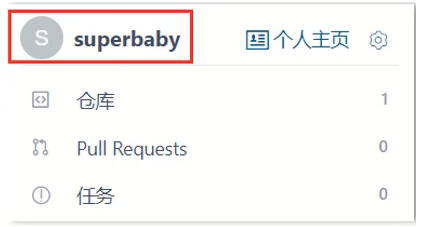
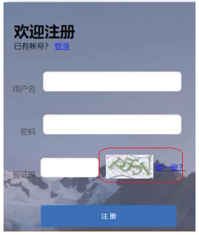
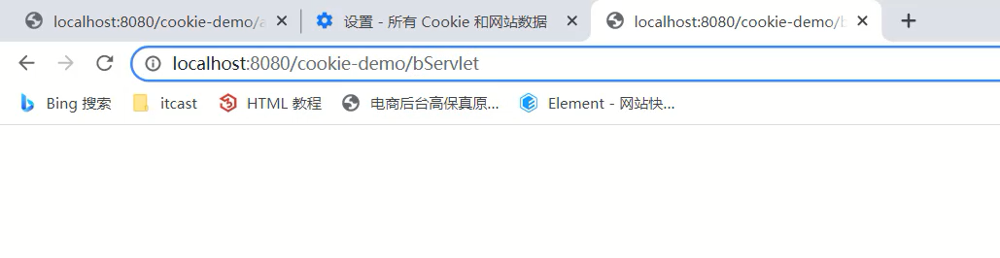
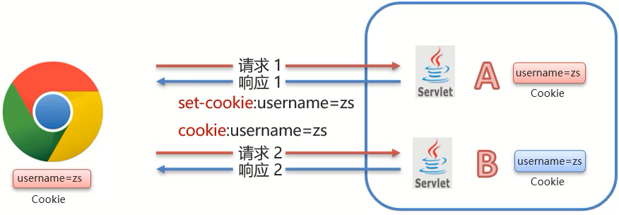
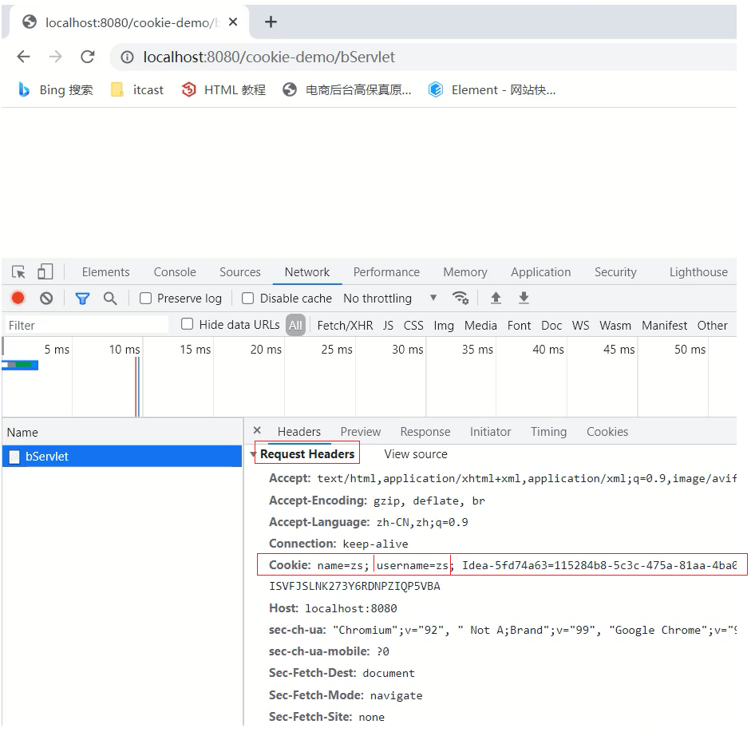
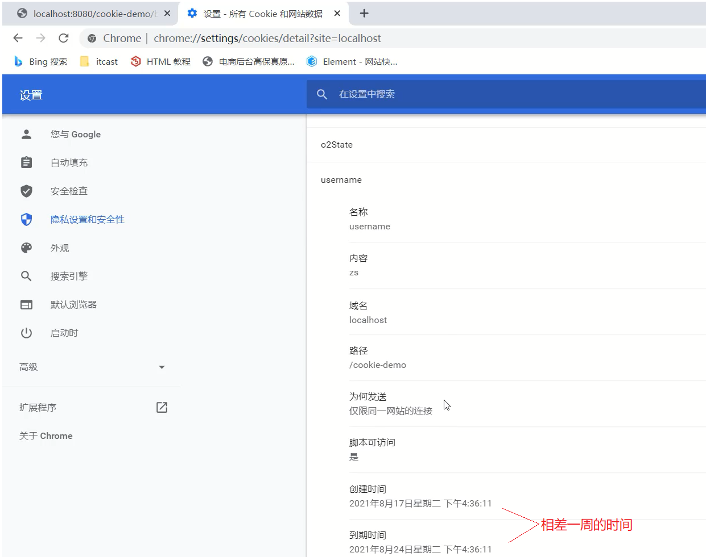

---

category:
- JavaWeb

---

# 会话技术


## 1，会话跟踪技术的概述

对于`会话跟踪`这四个词，我们需要拆开来进行解释，首先要理解什么是`会话`，然后再去理解什么是`会话跟踪`:

* 会话:用户打开浏览器，访问web服务器的资源，会话建立，直到有一方断开连接，会话结束。在一次会话中可以包含==多次==请求和响应。

  * 从浏览器发出请求到服务端响应数据给前端之后，一次会话(在浏览器和服务器之间)就被建立了
  * 会话被建立后，如果浏览器或服务端都没有被关闭，则会话就会持续建立着
  * 浏览器和服务器就可以继续使用该会话进行请求发送和响应，上述的整个过程就被称之为==会话==。

  用实际场景来理解下会话，比如在我们访问京东的时候，当打开浏览器进入京东首页后，浏览器和京东的服务器之间就建立了一次会话，后面的搜索商品,查看商品的详情,加入购物车等都是在这一次会话中完成。

  思考:下图中总共建立了几个会话?

  

  每个浏览器都会与服务端建立了一个会话，加起来总共是==3==个会话。

* 会话跟踪:一种维护浏览器状态的方法，服务器需要识别多次请求是否来自于同一浏览器，以便在同一次会话的多次请求间==共享数据==。

  * 服务器会收到多个请求，这多个请求可能来自多个浏览器，如上图中的6个请求来自3个浏览器
  * 服务器需要用来识别请求是否来自同一个浏览器
  * 服务器用来识别浏览器的过程，这个过程就是==会话跟踪==
  * 服务器识别浏览器后就可以在同一个会话中多次请求之间来共享数据

  那么我们又有一个问题需要思考，一个会话中的多次请求为什么要共享数据呢?有了这个数据共享功能后能实现哪些功能呢?

  * 购物车: `加入购物车`和`去购物车结算`是两次请求，但是后面这次请求要想展示前一次请求所添加的商品，就需要用到数据共享。

    

  * 页面展示用户登录信息:很多网站，登录后访问多个功能发送多次请求后，浏览器上都会有当前登录用户的信息[用户名]，比如百度、京东、码云等。

    

  * 网站登录页面的`记住我`功能:当用户登录成功后，勾选`记住我`按钮后下次再登录的时候，网站就会自动填充用户名和密码，简化用户的登录操作，多次登录就会有多次请求，他们之间也涉及到共享数据

    

  * 登录页面的验证码功能:生成验证码和输入验证码点击注册这也是两次请求，这两次请求的数据之间要进行对比，相同则允许注册，不同则拒绝注册，该功能的实现也需要在同一次会话中共享数据。

    

通过这几个例子的讲解，相信大家对`会话追踪`技术已经有了一定的理解，该技术在实际开发中也非常重要。那么接下来我们就需要去学习下`会话跟踪`技术，在学习这些技术之前，我们需要思考:为什么现在浏览器和服务器不支持数据共享呢?

* 浏览器和服务器之间使用的是HTTP请求来进行数据传输
* HTTP协议是==无状态==的，每次浏览器向服务器请求时，服务器都会将该请求视为==新的==请求
* HTTP协议设计成无状态的目的是让每次请求之间相互独立，互不影响
* 请求与请求之间独立后，就无法实现多次请求之间的数据共享

分析完具体的原因后，那么该如何实现会话跟踪技术呢? 具体的实现方式有:

(1)客户端会话跟踪技术：==Cookie==

(2)服务端会话跟踪技术：==Session==

这两个技术都可以实现会话跟踪，它们之间最大的区别:==Cookie是存储在浏览器端而Session是存储在服务器端==

具体的学习思路为:

* CooKie的基本使用、原理、使用细节
* Session的基本使用、原理、使用细节
* Cookie和Session的综合案例

**小结**

在这节中，我们主要介绍了下什么是会话和会话跟踪技术，需要注意的是:

* HTTP协议是无状态的，靠HTTP协议是无法实现会话跟踪
* 想要实现会话跟踪，就需要用到Cookie和Session

这个Cookie和Session具体该如何使用，接下来就先从Cookie来学起。

## 2，Cookie

学习Cookie，我们主要解决下面几个问题:

* 什么是Cookie?
* Cookie如何来使用?
* Cookie是如何实现的?
* Cookie的使用注意事项有哪些?

### 2.1 Cookie的基本使用

**1.概念**

==Cookie==：客户端会话技术，将数据保存到客户端，以后每次请求都携带Cookie数据进行访问。

**2.Cookie的工作流程**


* 服务端提供了两个Servlet，分别是ServletA和ServletB
* 浏览器发送HTTP请求1给服务端，服务端ServletA接收请求并进行业务处理
* 服务端ServletA在处理的过程中可以创建一个Cookie对象并将`name=zs`的数据存入Cookie
* 服务端ServletA在响应数据的时候，会把Cookie对象响应给浏览器
* 浏览器接收到响应数据，会把Cookie对象中的数据存储在浏览器内存中，此时浏览器和服务端就==建立了一次会话==
* ==在同一次会话==中浏览器再次发送HTTP请求2给服务端ServletB，浏览器会携带Cookie对象中的所有数据
* ServletB接收到请求和数据后，就可以获取到存储在Cookie对象中的数据，这样同一个会话中的多次请求之间就实现了数据共享

**3.Cookie的基本使用**

对于Cookie的使用，我们更关注的应该是后台代码如何操作Cookie，对于Cookie的操作主要分两大类，本别是==发送Cookie==和==获取Cookie==,对于上面这两块内容，分别该如何实现呢?

3.1 发送Cookie

* 创建Cookie对象，并设置数据

```
Cookie cookie = new Cookie("key","value");
```

* 发送Cookie到客户端：使用==response==对象

```
response.addCookie(cookie);
```

介绍完发送Cookie对应的步骤后，接下面通过一个案例来完成Cookie的发送，具体实现步骤为:

> 需求:在Servlet中生成Cookie对象并存入数据，然后将数据发送给浏览器
>
> 1.创建Maven项目,项目名称为cookie-demo，并在pom.xml添加依赖
>
> 2.编写Servlet类，名称为AServlet
>
> 3.在AServlet中创建Cookie对象，存入数据，发送给前端
>
> 4.启动测试，在浏览器查看Cookie对象中的值

(1)创建Maven项目cookie-demo，并在pom.xml添加依赖

```xml
<properties>
    <maven.compiler.source>8</maven.compiler.source>
    <maven.compiler.target>8</maven.compiler.target>
</properties>

<dependencies>
    <!--servlet-->
    <dependency>
        <groupId>javax.servlet</groupId>
        <artifactId>javax.servlet-api</artifactId>
        <version>3.1.0</version>
        <scope>provided</scope>
    </dependency>
    <!--jsp-->
    <dependency>
        <groupId>javax.servlet.jsp</groupId>
        <artifactId>jsp-api</artifactId>
        <version>2.2</version>
        <scope>provided</scope>
    </dependency>
    <!--jstl-->
    <dependency>
        <groupId>jstl</groupId>
        <artifactId>jstl</artifactId>
        <version>1.2</version>
    </dependency>
    <dependency>
        <groupId>taglibs</groupId>
        <artifactId>standard</artifactId>
        <version>1.1.2</version>
    </dependency>
</dependencies>
<build>
    <plugins>
        <plugin>
            <groupId>org.apache.tomcat.maven</groupId>
            <artifactId>tomcat7-maven-plugin</artifactId>
            <version>2.2</version>
        </plugin>
    </plugins>
</build>
```

(2)编写Servlet类，名称为AServlet

```java
@WebServlet("/aServlet")
public class AServlet extends HttpServlet {
    @Override
    protected void doGet(HttpServletRequest request, HttpServletResponse response) throws ServletException, IOException {

    }

    @Override
    protected void doPost(HttpServletRequest request, HttpServletResponse response) throws ServletException, IOException {
        this.doGet(request, response);
    }
}
```

(3)在Servlet中创建Cookie对象，存入数据，发送给前端

```java
@WebServlet("/aServlet")
public class AServlet extends HttpServlet {
    @Override
    protected void doGet(HttpServletRequest request, HttpServletResponse response) throws ServletException, IOException {
        //发送Cookie
        //1. 创建Cookie对象
        Cookie cookie = new Cookie("username","zs");
        //2. 发送Cookie，response
        response.addCookie(cookie);
    }

    @Override
    protected void doPost(HttpServletRequest request, HttpServletResponse response) throws ServletException, IOException {
        this.doGet(request, response);
    }
}
```

（4）启动测试，在浏览器查看Cookie对象中的值

访问`http://localhost:8080/cookie-demo/aServlet`

chrome浏览器查看Cookie的值，有两种方式,分布式:

方式一:


方式二:选中打开开发者工具或者 使用快捷键F12 或者 Ctrl+Shift+I


3.2 获取Cookie

- 获取客户端携带的所有Cookie，使用==request==对象

```
Cookie[] cookies = request.getCookies();
```

- 遍历数组，获取每一个Cookie对象：for
- 使用Cookie对象方法获取数据

```
cookie.getName();
cookie.getValue();
```

介绍完获取Cookie对应的步骤后，接下面再通过一个案例来完成Cookie的获取，具体实现步骤为:

> 需求:在Servlet中获取前一个案例存入在Cookie对象中的数据
>
> 1.编写一个新Servlet类，名称为BServlet
>
> 2.在BServlet中使用request对象获取Cookie数组，遍历数组，从数据中获取指定名称对应的值
>
> 3.启动测试，在控制台打印出获取的值

(1)编写一个新Servlet类，名称为BServlet

```java
@WebServlet("/bServlet")
public class BServlet extends HttpServlet {
    @Override
    protected void doGet(HttpServletRequest request, HttpServletResponse response) throws ServletException, IOException {

    }

    @Override
    protected void doPost(HttpServletRequest request, HttpServletResponse response) throws ServletException, IOException {
        this.doGet(request, response);
    }
}
```

（2）在BServlet中使用request对象获取Cookie数组，遍历数组，从数据中获取指定名称对应的值

```java
@WebServlet("/bServlet")
public class BServlet extends HttpServlet {
    @Override
    protected void doGet(HttpServletRequest request, HttpServletResponse response) throws ServletException, IOException {
        //获取Cookie
        //1. 获取Cookie数组
        Cookie[] cookies = request.getCookies();
        //2. 遍历数组
        for (Cookie cookie : cookies) {
            //3. 获取数据
            String name = cookie.getName();
            if("username".equals(name)){
                String value = cookie.getValue();
                System.out.println(name+":"+value);
                break;
            }
        }

    }

    @Override
    protected void doPost(HttpServletRequest request, HttpServletResponse response) throws ServletException, IOException {
        this.doGet(request, response);
    }
}
```

（3）启动测试，在控制台打印出获取的值

访问`http://localhost:8080/cookie-demo/bServlet`



在IDEA控制台就能看到输出的结果:


==思考:==测试的时候

* 在访问AServlet和BServlet的中间把关闭浏览器,重启浏览器后访问BServlet能否获取到Cookie中的数据?

这个问题，我们会在Cookie的使用细节中讲，大家可以动手先试下。

**小结**

在这节中，我们主要讲解了Cookie的基本使用,包含两部分内容

- 发送Cookie:
  - 创建Cookie对象，并设置值:Cookie cookie = new Cookie("key","value");
  - 发送Cookie到客户端使用的是Reponse对象:response.addCookie(cookie);
- 获取Cookie:
  - 使用Request对象获取Cookie数组:Cookie[] cookies = request.getCookies();
  - 遍历数组
  - 获取数组中每个Cookie对象的值:cookie.getName()和cookie.getValue()

介绍完Cookie的基本使用之后，那么Cookie的底层到底是如何实现一次会话两次请求之间的数据共享呢?

### 2.2 Cookie的原理分析

对于Cookie的实现原理是基于HTTP协议的,其中设计到HTTP协议中的两个请求头信息:

* 响应头:set-cookie
* 请求头: cookie



* 前面的案例中已经能够实现，AServlet给前端发送Cookie,BServlet从request中获取Cookie的功能
* 对于AServlet响应数据的时候，Tomcat服务器都是基于HTTP协议来响应数据
* 当Tomcat发现后端要返回的是一个Cookie对象之后，Tomcat就会在响应头中添加一行数据==`Set-Cookie:username=zs`==
* 浏览器获取到响应结果后，从响应头中就可以获取到`Set-Cookie`对应值`username=zs`,并将数据存储在浏览器的内存中
* 浏览器再次发送请求给BServlet的时候，浏览器会自动在请求头中添加==`Cookie: username=zs`==发送给服务端BServlet
* Request对象会把请求头中cookie对应的值封装成一个个Cookie对象，最终形成一个数组
* BServlet通过Request对象获取到Cookie[]后，就可以从中获取自己需要的数据

接下来，使用刚才的案例，把上述结论验证下:

(1)访问AServlet对应的地址`http://localhost:8080/cookie-demo/aServlet`

使用Chrom浏览器打开开发者工具(F12或Crtl+Shift+I)进行查看==响应头==中的数据


（2）访问BServlet对应的地址`http://localhost:8080/cookie-demo/bServlet

使用Chrom浏览器打开开发者工具(F12或Crtl+Shift+I)进行查看==请求头==中的数据



### 2.3 Cookie的使用细节

在这节我们主要讲解两个知识，第一个是Cookie的存活时间，第二个是Cookie如何存储中文，首先来学习下Cookie的存活时间。

#### 2.3.1 Cookie的存活时间

前面让大家思考过一个问题:


(1)浏览器发送请求给AServlet,AServlet会响应一个存有`usernanme=zs`的Cookie对象给浏览器

(2)浏览器接收到响应数据将cookie存入到浏览器内存中

(3)当浏览器再次发送请求给BServlet,BServlet就可以使用Request对象获取到Cookie数据

(4)在发送请求到BServlet之前，如果把浏览器关闭再打开进行访问，BServlet能否获取到Cookie数据?

==注意：浏览器关闭再打开不是指打开一个新的选显卡，而且必须是先关闭再打开，顺序不能变。==

针对上面这个问题，通过演示，会发现，BServlet中无法再获取到Cookie数据，这是为什么呢?

* 默认情况下，Cookie存储在浏览器内存中，当浏览器关闭，内存释放，则Cookie被销毁

这个结论就印证了上面的演示效果，但是如果使用这种默认情况下的Cookie,有些需求就无法实现，比如:


上面这个网站的登录页面上有一个`记住我`的功能，这个功能大家都比较熟悉

* 第一次输入用户名和密码并勾选`记住我`然后进行登录
* 下次再登陆的时候，用户名和密码就会被自动填充，不需要再重新输入登录
* 比如`记住我`这个功能需要记住用户名和密码一个星期，那么使用默认情况下的Cookie就会出现问题
* 因为默认情况，浏览器一关，Cookie就会从浏览器内存中删除，对于`记住我`功能就无法实现

所以我们现在就遇到一个难题是如何将Cookie持久化存储?

Cookie其实已经为我们提供好了对应的API来完成这件事，这个API就是==setMaxAge==,

* 设置Cookie存活时间

```
setMaxAge(int seconds)
```

参数值为:

1.正数：将Cookie写入浏览器所在电脑的硬盘，持久化存储。到时间自动删除

2.负数：默认值，Cookie在当前浏览器内存中，当浏览器关闭，则Cookie被销毁

3.零：删除对应Cookie. 如果设置为0，想删除某个cookie，则必须保证cookie以下属性一致。path、domain、name

接下来，咱们就在AServlet中去设置Cookie的存活时间。

```java
@WebServlet("/aServlet")
public class AServlet extends HttpServlet {
    @Override
    protected void doGet(HttpServletRequest request, HttpServletResponse response) throws ServletException, IOException {
        //发送Cookie
        //1. 创建Cookie对象
        Cookie cookie = new Cookie("username","zs");
        //设置存活时间   ，1周 7天
        cookie.setMaxAge(60*60*24*7); //易阅读，需程序计算
		//cookie.setMaxAge(604800); //不易阅读(可以使用注解弥补)，程序少进行一次计算
        //2. 发送Cookie，response
        response.addCookie(cookie);
    }

    @Override
    protected void doPost(HttpServletRequest request, HttpServletResponse response) throws ServletException, IOException {
        this.doGet(request, response);
    }
}
```

修改完代码后，启动测试，访问`http://localhost:8080/cookie-demo/aServlet`

* 访问一个AServlet后，把浏览器关闭重启后，再去访问`http://localhost:8080/cookie-demo/bServet`,能在控制台打印出`username:zs`,说明Cookie没有随着浏览器关闭而被销毁
*  通过浏览器查看Cookie的内容，会发现Cookie的相关信息



#### 2.3.2 Cookie存储中文

首先，先来演示一个效果，将之前`username=zs`的值改成`username=张三`，把汉字`张三`存入到Cookie中，看是什么效果:

```java
@WebServlet("/aServlet")
public class AServlet extends HttpServlet {
    @Override
    protected void doGet(HttpServletRequest request, HttpServletResponse response) throws ServletException, IOException {
 		//发送Cookie
        String value = "张三";
        Cookie cookie = new Cookie("username",value);
        //设置存活时间   ，1周 7天
        cookie.setMaxAge(60*60*24*7);
        //2. 发送Cookie，response
        response.addCookie(cookie);
    }

    @Override
    protected void doPost(HttpServletRequest request, HttpServletResponse response) throws ServletException, IOException {
        this.doGet(request, response);
    }
}
```

启动访问测试，访问`http://localhost:8080/cookie-demo/aServlet`会发现浏览器会提示错误信息


通过上面的案例演示，我们得到一个结论:

* Cookie不能直接存储中文

Cookie不能存储中文，但是如果有这方面的需求，这个时候该如何解决呢?

这个时候，我们可以使用之前学过的一个知识点叫`URL编码`，所以如果需要存储中文，就需要进行转码，具体的实现思路为:

> 1.在AServlet中对中文进行URL编码，采用URLEncoder.encode()，将编码后的值存入Cookie中
>
> 2.在BServlet中获取Cookie中的值,获取的值为URL编码后的值
>
> 3.将获取的值在进行URL解码,采用URLDecoder.decode()，就可以获取到对应的中文值

(1)在AServlet中对中文进行URL编码

```java
@WebServlet("/aServlet")
public class AServlet extends HttpServlet {
    @Override
    protected void doGet(HttpServletRequest request, HttpServletResponse response) throws ServletException, IOException {
        //发送Cookie
        String value = "张三";
        //对中文进行URL编码
        value = URLEncoder.encode(value, "UTF-8");
        System.out.println("存储数据："+value);
        //将编码后的值存入Cookie中
        Cookie cookie = new Cookie("username",value);
        //设置存活时间   ，1周 7天
        cookie.setMaxAge(60*60*24*7);
        //2. 发送Cookie，response
        response.addCookie(cookie);
    }

    @Override
    protected void doPost(HttpServletRequest request, HttpServletResponse response) throws ServletException, IOException {
        this.doGet(request, response);
    }
}
```

(2)在BServlet中获取值，并对值进行解码

```java
@WebServlet("/bServlet")
public class BServlet extends HttpServlet {
    @Override
    protected void doGet(HttpServletRequest request, HttpServletResponse response) throws ServletException, IOException {
        //获取Cookie
        //1. 获取Cookie数组
        Cookie[] cookies = request.getCookies();
        //2. 遍历数组
        for (Cookie cookie : cookies) {
            //3. 获取数据
            String name = cookie.getName();
            if("username".equals(name)){
                String value = cookie.getValue();//获取的是URL编码后的值 %E5%BC%A0%E4%B8%89
                //URL解码
                value = URLDecoder.decode(value,"UTF-8");
                System.out.println(name+":"+value);//value解码后为 张三
                break;
            }
        }

    }

    @Override
    protected void doPost(HttpServletRequest request, HttpServletResponse response) throws ServletException, IOException {
        this.doGet(request, response);
    }
}
```

至此，我们就可以将中文存入Cookie中进行使用。

**小结**

Cookie的使用细节中，我们讲了Cookie的`存活时间`和`存储中文`:

* 存活时间，需要掌握setMaxAage()API的使用
* 存储中文，需要掌握URL编码和解码的使用


```java
// 想要删除一个已经保存的cookie，要先创建一个cookie，设置其name、path、domain和要删除的cookie都一致，然后设置其maxAge为0，把此cookie覆盖设置到浏览器。

Cookie c = new Cookie("username","");
cookie.setPath(request.getContextPath());// 有效路径，只有当前请求的路径和一个cookie的path匹配时，cookie才会被浏览器自动携带。path在没有手动设置的时候有默认设置规则。以当前的请求路径的最后一个目录为准。例如：如果访问http://localhost:8080/cookie-demo/aaa/bbb/ccc/ServletDemo  路径，在这个servlet中响应设置了一个cookie，此cookie的默认path为/cookie-demo/aaa/bbb/ccc。如果下一次发请求时，url在这个目录中，cookie就会携带。否则cookie不携带。
// http://localhost:8080/cookie-demo/aaa/ddd/ServleltDemo2,此时cookie不携带。
// http://localhost:8080/cookie-demo/aaa/bbb/ccc/eee/xxxxServlet，此时cookie携带
// 通常我们会把path设置为项目的虚拟目录。
c.setDomain("");// 设置cookie的有效域名，通常不设置，代表默认域名，就是设置cookie时访问的域名。只有访问的域名和cookie的域名一致时才会自动携带cookie。如果有服务集群的时候，一半会设置。例如：c.setDomain(".baidu.com");
c.setMaxAge(0);
response.addCookie(c);
```

## 3，Session

Cookie已经能完成一次会话多次请求之间的数据共享，之前我们还提到过Session也可以实现，那么:

- 什么是Session?
- Session如何来使用?
- Session是如何实现的?
- Session的使用注意事项有哪些?

### 3.1 Session的基本使用

**1.概念**

==Session==：服务端会话跟踪技术：将数据保存到服务端。

* Session是存储在服务端而Cookie是存储在客户端
* 存储在客户端的数据容易被窃取和截获，存在很多不安全的因素
* 存储在服务端的数据相比于客户端来说就更安全

**2.Session的工作流程**

 

* 在服务端的AServlet获取一个Session对象，把数据存入其中
* 在服务端的BServlet获取到相同的Session对象，从中取出数据
* 就可以实现一次会话中多次请求之间的数据共享了
* 现在最大的问题是如何保证AServlet和BServlet使用的是同一个Session对象(在原理分析会讲解)?

**3.Session的基本使用**

在JavaEE中提供了HttpSession接口，来实现一次会话的多次请求之间数据共享功能。

具体的使用步骤为:

* 获取Session对象,使用的是request对象

```
HttpSession session = request.getSession();
```

* Session对象提供的功能:

  * 存储数据到 session 域中

    ```
    void setAttribute(String name, Object o)
    ```

  * 根据 key，获取值

    ```
    Object getAttribute(String name)
    ```

  * 根据 key，删除该键值对

    ```
    void removeAttribute(String name)
    ```

介绍完Session相关的API后，接下来通过一个案例来完成对Session的使用，具体实现步骤为:

> 需求:在一个Servlet中往Session中存入数据，在另一个Servlet中获取Session中存入的数据
>
> 1.创建名为SessionDemo1的Servlet类
>
> 2.创建名为SessionDemo2的Servlet类
>
> 3.在SessionDemo1的方法中:获取Session对象、存储数据
>
> 4.在SessionDemo2的方法中:获取Session对象、获取数据
>
> 5.启动测试

(1)创建名为SessionDemo1的Servlet类

```java
@WebServlet("/demo1")
public class SessionDemo1 extends HttpServlet {
    @Override
    protected void doGet(HttpServletRequest request, HttpServletResponse response) throws ServletException, IOException {

    }

    @Override
    protected void doPost(HttpServletRequest request, HttpServletResponse response) throws ServletException, IOException {
        this.doGet(request, response);
    }
}
```

(2)创建名为SessionDemo2的Servlet类

```java
@WebServlet("/demo2")
public class SessionDemo2 extends HttpServlet {
    @Override
    protected void doGet(HttpServletRequest request, HttpServletResponse response) throws ServletException, IOException {

    }

    @Override
    protected void doPost(HttpServletRequest request, HttpServletResponse response) throws ServletException, IOException {
        this.doGet(request, response);
    }
}
```

(3)SessionDemo1:获取Session对象、存储数据

```java
@WebServlet("/demo1")
public class SessionDemo1 extends HttpServlet {
    @Override
    protected void doGet(HttpServletRequest request, HttpServletResponse response) throws ServletException, IOException {
    	//存储到Session中
        //1. 获取Session对象
        HttpSession session = request.getSession();
        //2. 存储数据
        session.setAttribute("username","zs");
    }

    @Override
    protected void doPost(HttpServletRequest request, HttpServletResponse response) throws ServletException, IOException {
        this.doGet(request, response);
    }
}
```

(4)SessionDemo2:获取Session对象、获取数据

```java
@WebServlet("/demo2")
public class SessionDemo2 extends HttpServlet {
    @Override
    protected void doGet(HttpServletRequest request, HttpServletResponse response) throws ServletException, IOException {
        //获取数据，从session中
        //1. 获取Session对象
        HttpSession session = request.getSession();
        //2. 获取数据
        Object username = session.getAttribute("username");
        System.out.println(username);
    }

    @Override
    protected void doPost(HttpServletRequest request, HttpServletResponse response) throws ServletException, IOException {
        this.doGet(request, response);
    }
}
```

(5)启动测试，

* 先访问`http://localhost:8080/cookie-demo/demo1`,将数据存入Session
* 在访问`http://localhost:8080/cookie-demo/demo2`,从Session中获取数据
* 查看控制台


通过案例的效果，能看到Session是能够在一次会话中两次请求之间共享数据。

**小结**

至此Session的基本使用就已经完成了，重点要掌握的是:

* Session的获取

  ```
  HttpSession session = request.getSession();
  ```

* Session常用方法的使用

  ```
  void setAttribute(String name, Object o)
  Object getAttribute(String name)
  ```

  **注意:**Session中可以存储的是一个Object类型的数据，也就是说Session中可以存储任意数据类型。

介绍完Session的基本使用之后，那么Session的底层到底是如何实现一次会话两次请求之间的数据共享呢?

### 3.2 Session的原理分析

* Session是基于Cookie实现的

这句话其实不太能详细的说明Session的底层实现，接下来，咱们一步步来分析下Session的具体实现原理:

(1)前提条件


Session要想实现一次会话多次请求之间的数据共享，就必须要保证多次请求获取Session的对象是同一个。

那么它们是一个对象么？要验证这个结论也很简单，只需要在上面案例中的两个Servlet中分别打印下Session对象

SessionDemo1

```java
@WebServlet("/demo1")
public class SessionDemo1 extends HttpServlet {
    @Override
    protected void doGet(HttpServletRequest request, HttpServletResponse response) throws ServletException, IOException {
    	//存储到Session中
        //1. 获取Session对象
        HttpSession session = request.getSession();
        System.out.println(session);
        //2. 存储数据
        session.setAttribute("username","zs");
    }

    @Override
    protected void doPost(HttpServletRequest request, HttpServletResponse response) throws ServletException, IOException {
        this.doGet(request, response);
    }
}
```

SessionDemo2

```java
@WebServlet("/demo2")
public class SessionDemo2 extends HttpServlet {
    @Override
    protected void doGet(HttpServletRequest request, HttpServletResponse response) throws ServletException, IOException {
        //获取数据，从session中
        //1. 获取Session对象
        HttpSession session = request.getSession();
        System.out.println(session);
        //2. 获取数据
        Object username = session.getAttribute("username");
        System.out.println(username);
    }

    @Override
    protected void doPost(HttpServletRequest request, HttpServletResponse response) throws ServletException, IOException {
        this.doGet(request, response);
    }
}
```

启动测试，分别访问

`http://localhost:8080/cookie-demo/demo1`

`http://localhost:8080/cookie-demo/demo2`


通过打印可以得到如下结论:

* 两个Servlet类中获取的Session对象是同一个
* 把demo1和demo2请求刷新多次，控制台最终打印的结果都是同一个

那么问题又来了，如果新开一个浏览器，访问demo1或者demo2,打印在控制台的Session还是同一个对象么?


==注意:在一台电脑上演示的时候，如果是相同的浏览器必须要把浏览器全部关掉重新打开，才算新开的一个浏览器。==

当然也可以使用不同的浏览器进行测试，就不需要把之前的浏览器全部关闭。

测试的结果：如果是不同浏览器或者重新打开浏览器后，打印的Session就不一样了。

所以Session实现的也是一次会话中的多次请求之间的数据共享。

那么最主要的问题就来了，Session是如何保证在一次会话中获取的Session对象是同一个呢?


(1)demo1在第一次获取session对象的时候，session对象会有一个唯一的标识，假如是`id:10`

(2)demo1在session中存入其他数据并处理完成所有业务后，需要通过Tomcat服务器响应结果给浏览器

(3)Tomcat服务器发现业务处理中使用了session对象，就会把session的唯一标识`id:10`当做一个cookie，添加`Set-Cookie:JESSIONID=10`到响应头中，并响应给浏览器

(4)浏览器接收到响应结果后，会把响应头中的coookie数据存储到浏览器的内存中

(5)浏览器在同一会话中访问demo2的时候，会把cookie中的数据按照`cookie: JESSIONID=10`的格式添加到请求头中并发送给服务器Tomcat

(6)demo2获取到请求后，从请求头中就读取cookie中的JSESSIONID值为10，然后就会到服务器内存中寻找`id:10`的session对象，如果找到了，就直接返回该对象，如果没有则新创建一个session对象

(7)关闭打开浏览器后，因为浏览器的cookie已被销毁，所以就没有JESSIONID的数据，服务端获取到的session就是一个全新的session对象

至此，`Session是基于Cookie来实现的`这就话，我们就解释完了，接下来通过实例来演示下:

(1)使用chrome浏览器访问`http://localhost:8080/cookie-demo/demo1`,打开开发者模式(F12或Ctrl+Shift+I),查看==响应头(Response Headers)==数据:


(2)使用chrome浏览器再次访问`http://localhost:8080/cookie-demo/demo2`，查看==请求头(Request Headers)==数据:


**小结**

介绍完Session的原理，我们只需要记住

* Session是基于Cookie来实现的

### 3.3 Session的使用细节

这节我们会主要讲解两个知识，第一个是Session的钝化和活化，第二个是Session的销毁，首先来学习什么是Session的钝化和活化？

#### 3.3.1 Session钝化与活化

首先需要大家思考的问题是:

* 服务器重启后，Session中的数据是否还在?

要想回答这个问题，我们可以先看下下面这幅图，


(1)服务器端AServlet和BServlet共用的session对象应该是存储在服务器的内存中

(2)服务器重新启动后，内存中的数据应该是已经被释放，对象也应该都销毁了

所以session数据应该也已经不存在了。但是如果session不存在会引发什么问题呢?

举个例子说明下，

(1)用户把需要购买的商品添加到购物车，因为要实现同一个会话多次请求数据共享，所以假设把数据存入Session对象中

(2)用户正要付钱的时候接到一个电话，付钱的动作就搁浅了

(3)正在用户打电话的时候，购物网站因为某些原因需要重启

(4)重启后session数据被销毁，购物车中的商品信息也就会随之而消失

(5)用户想再次发起支付，就会出为问题

所以说对于session的数据，我们应该做到就算服务器重启了，也应该能把数据保存下来才对。

分析了这么多，那么Tomcat服务器在重启的时候，session数据到底会不会保存以及是如何保存的，我们可以通过实际案例来演示下:

==注意:这里所说的关闭和启动应该要确保是正常的关闭和启动。==

那如何才是正常关闭Tomcat服务器呢?

需要使用命令行的方式来启动和停止Tomcat服务器:

==启动==:进入到项目pom.xml所在目录，执行`tomcat7:run`


==停止==:在启动的命令行界面，输入`ctrl+c`


有了上述两个正常启动和关闭的方式后，接下来的测试流程是:

(1)先启动Tomcat服务器

(2)访问`http://localhost:8080/cookie-demo/demo1`将数据存入session中

(3)正确停止Tomcat服务器

(4)再次重新启动Tomcat服务器

(5)访问`http://localhost:8080/cookie-demo/demo2` 查看是否能获取到session中的数据


经过测试，会发现只要服务器是正常关闭和启动，session中的数据是可以被保存下来的。

那么Tomcat服务器到底是如何做到的呢?

具体的原因就是:Session的钝化和活化:

* 钝化：在服务器正常关闭后，Tomcat会自动将Session数据写入硬盘的文件中

  * 钝化的数据路径为:`项目目录\target\tomcat\work\Tomcat\localhost\项目名称\SESSIONS.ser`

    

* 活化：再次启动服务器后，从文件中加载数据到Session中

  * 数据加载到Session中后，路径中的`SESSIONS.ser`文件会被删除掉

对于上述的整个过程，大家只需要了解下即可。因为所有的过程都是Tomcat自己完成的，不需要我们参与。

**小结**

Session的钝化和活化介绍完后，需要我们注意的是:

* session数据存储在服务端，服务器重启后，session数据会被保存
* 浏览器被关闭启动后，重新建立的连接就已经是一个全新的会话，获取的session数据也是一个新的对象
* session的数据要想共享，浏览器不能关闭，所以session数据不能长期保存数据
* cookie是存储在客户端，是可以长期保存

> session中可以存储任意类型的对象，如果我们存入了自定义类型的对象，想要让session在钝化和活化的时候把存储的对象也同时进行存储和还原，此时我们的对象必须实现序列化接口。

#### 3.3.2 Session销毁

session的销毁会有两种方式:

* 默认情况下，无操作，30分钟自动销毁

  * 对于这个失效时间，是可以通过配置进行修改的

    * 在项目的web.xml中配置

      ```xml
      <?xml version="1.0" encoding="UTF-8"?>
      <web-app xmlns="http://xmlns.jcp.org/xml/ns/javaee"
               xmlns:xsi="http://www.w3.org/2001/XMLSchema-instance"
               xsi:schemaLocation="http://xmlns.jcp.org/xml/ns/javaee http://xmlns.jcp.org/xml/ns/javaee/web-app_3_1.xsd"
               version="3.1">

          <session-config>
              <session-timeout>100</session-timeout>
          </session-config>
      </web-app>
      ```

    * 如果没有配置，默认是30分钟，默认值是在Tomcat的web.xml配置文件中写死的

      

* 调用Session对象的invalidate()进行销毁

  * 在SessionDemo2类中添加session销毁的方法

    ```java
    @WebServlet("/demo2")
    public class SessionDemo2 extends HttpServlet {
        @Override
        protected void doGet(HttpServletRequest request, HttpServletResponse response) throws ServletException, IOException {
            //获取数据，从session中

            //1. 获取Session对象
            HttpSession session = request.getSession();
            System.out.println(session);

            // 销毁
            session.invalidate();
            //2. 获取数据
            Object username = session.getAttribute("username");
            System.out.println(username);
        }

        @Override
        protected void doPost(HttpServletRequest request, HttpServletResponse response) throws ServletException, IOException {
            this.doGet(request, response);
        }
    }
    ```

  * 启动访问测试，先访问demo1将数据存入到session，再次访问demo2从session中获取数据

    

  * 该销毁方法一般会在用户退出的时候，需要将session销毁掉。

**Cookie和Session小结**

* Cookie 和 Session 都是来完成一次会话内多次请求间==数据共享==的。

所需两个对象放在一块，就需要思考:

Cookie和Session的区别是什么?

Cookie和Session的应用场景分别是什么?

* 区别:
  * 存储位置：Cookie 是将数据存储在客户端，Session 将数据存储在服务端
  * 安全性：Cookie不安全，Session安全
  * 数据大小：Cookie有大小和数量个数，Session无大小限制
  * 存储时间：Cookie可以通过setMaxAge()长期存储，Session默认30分钟
  * 服务器性能：Cookie不占服务器资源，Session占用服务器资源
* 应用场景:
  * 购物车:使用Cookie来存储  用于未登录的状态下（现在都是数据库）
  * 以登录用户的名称展示:使用Session来存储
  * 记住我功能:使用Cookie来存储
  * 验证码:使用session来存储
* 结论
  * Cookie是用来保证用户在未登录情况下的身份识别
  * Session是用来保存用户登录后的数据

介绍完Cookie和Session以后，具体用哪个还是需要根据具体的业务进行具体分析。


