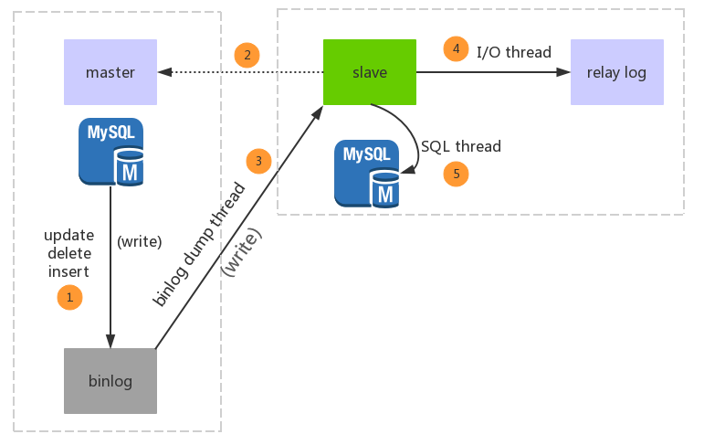
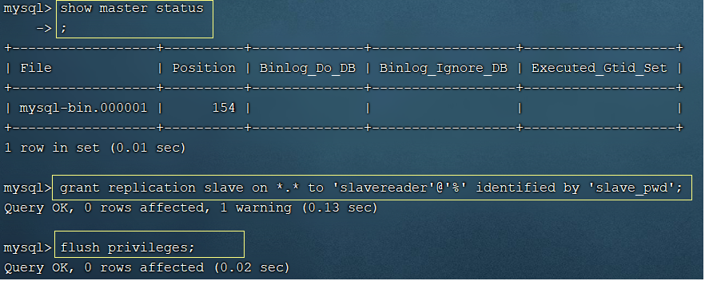
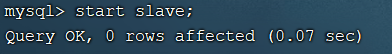
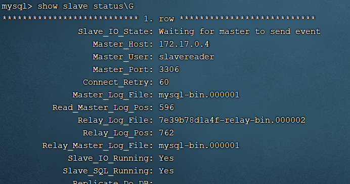
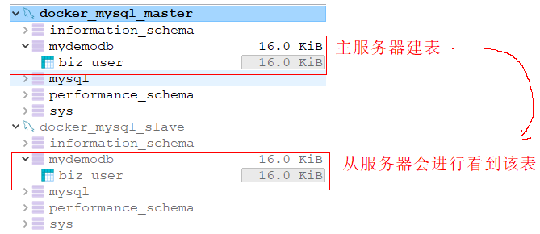

# Mysql读写分离

## 一、mysql主从环境搭建

### 1、环境介绍

1）本案例安装mysql5.7版本，使用的是docker容器方式进行安装。——Linux

> docker搜索网站可以参考：
> https://registry.hub.docker.com/_/mysql?tab=tags

2）拟定1主1从的基本配置，主服务主要进行DDL操作，从服务器进行DQL操作。

### 2、 拉取镜像

```shell
docker pull mysql:5.7
```

### 3、安装mysql主从服务

| 服务器定位 | 端口映射 | docker容器ip |
| ---------- | -------- | ------------ |
| 主master   | 33060    | 172.17.0.4   |
| 从slave1   | 33061    | 172.17.0.5   |

> docker容器IP可以通过下面命令查看：
>
> ```shell
> docker inspect 容器名/ID
> ```

#### 3.0 主从复制过程示意图

 

> 参考：
>
> `https://www.hoohack.me/2017/07/11/learning-mysql-replication-detail`

#### 3.1 master安装、配置

```shell
docker run -itd -p 33060:3306 --name mysql_master -e MYSQL_ROOT_PASSWORD=qwe123 mysql:5.7
```

> 此处没有进行目录挂载，所以会在docker容器中修改配置文件

#### 3.2 slave安装和配置

```shell
docker run -itd -p 33061:3306 --name mysql_master -e MYSQL_ROOT_PASSWORD=qwe123 mysql:5.7
```

#### 3.3 主服务器设置

1）进入mysql_master容器

```shell
docker exec -it mysql_master /bin/bash
```

在容器中修改配置文件需要下载vim插件

```shell
apt-get update
apt-get install vim
```

2）修改mysql配置文件内容

```shell
#进入 /etc/mysql/mysql.conf.d目录 window版本的：my.cnf
cd /etc/mysql/mysql.conf.d
#编辑mysqld.cnf配置文件
vim mysqld.cnf
```

> 在其中[mysqld]下添加配置
>
> ```shell
> log-bin=mysql-bin
> server-id=1
> binlog_format=mixed
> ```
>
> ```shell
> :wq
> ```
>
> 保存后退出容器。重启docker容器,并再次进入

```shell
docker restart mysql_master
docker exec -it mysql_master /bin/bash
```

3）登录容器中的mysql实例中

```shell
mysql -uroot -pqwe123
```

查看主节点状态，并且记录binlog文件名和偏移量；然后为从节点赋予权限

```sql
show master status;

-- 注意下面的DCL语句中
-- *.* 表示任意数据库(本案例没有指定具体数据库)的任意对象，
-- 'slavereader'@'%' 表示 从数据库连接用户名slavereader，ip任意
-- identified by 'slave_pwd' 密码是slave_pwd
grant replication slave on *.* to 'slavereader'@'%' identified by 'slave_pwd';

-- 刷新
flush privileges;
```

 

主服务器配置完毕！


#### 3.4 从服务器设置

1）进入mysql_slave容器

```shell
docker exec -it mysql_slave /bin/bash
```

在容器中修改配置文件需要下载vim插件

```shell
apt-get update
apt-get install vim
```

2）修改mysql配置文件内容

```shell
#进入 /etc/mysql/mysql.conf.d目录
cd /etc/mysql/mysql.conf.d
#编辑mysqld.cnf配置文件
vim mysqld.cnf
```

> 在其中[mysqld]下添加配置：此处的server-id=2，要异于主服务器id值
>
> ```shell
> log-bin=mysql-bin
> server-id=2
> binlog_format=mixed
> ```
>
> ```shell
> :wq
> ```
>
> 保存后退出容器。重启docker容器,并再次进入

```shell
docker restart mysql_slave
docker exec -it mysql_slave /bin/bash
```

3）登录容器中的mysql实例中

```shell
#此处的密码是我们在启动容器时，定义的root用户初始密码
mysql -uroot -pqwe123
```

为从服务器指定主服务器

```sql
-- 172.17.0.4是主服务器地址
-- slavereader是主服务器在赋从服务器权限时指定的用户名
-- slave_pwd是主服务器在赋从服务器权限时指定的密码
-- mysql-bin.000001和154分别是主服务器中的master status;
change master to master_host='172.17.0.4',master_user='slavereader',master_password='slave_pwd',master_log_file='mysql-bin.000001',master_log_pos=154;
```

4）然后启动从服务器角色

```sql
start slave;
```

 

查看从服务器状态

```sql
show slave status\G
```


 

> 可以看到主服务器信息，Slave_IO_Runningh和Slave_SQL_Running都是Yes

至此，从服务器搭建完毕。我们可以通过客户端连接工具分别连接这两个mysql实例，然后在主服务器中创建数据库并建表、插入记录，可以在从服务器中同步看到数据。

 


## 二、spring整合mybatis读写分离

> ​		本案例采用的是继承`AbstractRoutingDataSource`的方式，利用spring来对数据源进行线程绑定、挑选。
>
> ​		

### 基本思路：

```
通过spring的AbstractRoutingDataSource为本线程绑定数据源，mybatis从本线程上拿数据源，获取连接操作数据库！
```

### 代码实现：

`参考代码附件`。

### 基本步骤：


## 三、其他

#### 1）方案讨论

​		此方案有一个缺点，即无法在一个线程中切换数据源；即使完成切换，事务管理上还需要做分布式事务！此时，我们可以考虑另外一种途径来完成，如sharding-jdbc——该中间件对于分库分表的支持。

#### sharding-jdbc的使用：

##### 1.1 导入关键依赖

```xml
<properties>
    <java.version>1.8</java.version>
    <mybatis-plus.version>3.1.1</mybatis-plus.version>
    <sharding-sphere.version>4.0.0-RC2</sharding-sphere.version>
</properties>

<!--mybatis起步依赖-->
<dependency>
    <groupId>org.mybatis.spring.boot</groupId>
    <artifactId>mybatis-spring-boot-starter</artifactId>
    <version>1.3.2</version>
</dependency>
<dependency>
    <groupId>mysql</groupId>
    <artifactId>mysql-connector-java</artifactId>
</dependency>
<dependency>
    <groupId>com.alibaba</groupId>
    <artifactId>druid</artifactId>
    <version>1.2.1</version>
</dependency>
<!--sharding-jdbc 应用层面上分库分表-->
<dependency>
    <groupId>org.apache.shardingsphere</groupId>
    <artifactId>sharding-jdbc-spring-boot-starter</artifactId>
    <version>${sharding-sphere.version}</version>
</dependency>
<dependency>
    <groupId>org.apache.shardingsphere</groupId>
    <artifactId>sharding-jdbc-spring-namespace</artifactId>
    <version>${sharding-sphere.version}</version>
</dependency>
```


##### 1.2 配置主从

```yml
#配置主从 读写分离
spring:
  shardingsphere:
    datasource:
      names: master,slave0
      master:
        type: com.alibaba.druid.pool.DruidDataSource
        driver-class-name: com.mysql.jdbc.Driver
        url: jdbc:mysql://192.168.111.130:33060/mydemodb?serverTimezone=Asia/Shanghai&useUnicode=true&characterEncoding=utf8
        username: root
        password: qwe123
      slave0:
        type: com.alibaba.druid.pool.DruidDataSource
        driver-class-name: com.mysql.jdbc.Driver
        url: jdbc:mysql://192.168.111.130:33061/mydemodb?serverTimezone=Asia/Shanghai&useUnicode=true&characterEncoding=utf8
        username: root
        password: qwe123
    #配置主从规则
    masterslave:
      name: ms
      master-data-source-name: master
      #多个从节点使用,间隔
      slave-data-source-names: slave0
      #默认从节点轮询方式访问：RoundRobinMasterSlaveLoadBalanceAlgorithm； random:随机策略:RoundRobinMasterSlaveLoadBalanceAlgorithm
#      load-balance-algorithm-type: round_robin
    props:
      sql:
        show: true
```

##### 1.3 接口正常开发

```java
public interface WorkorderMapper {
    @Insert("insert into t_workorder(id,member_id,reason,receive_time) values(#{id},#{memberId},#{reason},#{receiveTime})")
    public int insertWorkorder(Workorder workorder);

    @Select("select * from t_workorder")
    public List<Workorder> findAll();
}
```

##### 1.4 引导类

```java
@SpringBootApplication(exclude = {DataSourceAutoConfiguration.class})
@MapperScan("com.itheima.shardingms.mapper")
public class ShardingMSApp {
    public static void main(String[] args) {
        SpringApplication.run(ShardingMSApp.class,args);
    }
}
```

##### 1.5 测试类

```java
@SpringBootTest
@RunWith(SpringRunner.class)
public class TestDBMS {

    @Autowired
    private WorkorderMapper workorderMapper;

    @Test
    public void insertWorkorder(){
        SnowFlake snowFlake = new SnowFlake(0,0);
        long id = snowFlake.nextId();

        Workorder workorder = new Workorder();
        workorder.setId(id);
        workorder.setMemberId(1L);
        workorder.setReason("refuse goods");
        workorder.setReceiveTime(new Date());
        workorderMapper.insertWorkorder(workorder);
    }

    @Test
    public void findAll(){
        List<Workorder> workorders = workorderMapper.findAll();
        System.out.println(workorders.size());
    }
}
```


#### 2）binlog_format

```
mysql复制主要有三种方式：
	基于SQL语句的复制(statement-based replication, SBR)，
	基于行的复制(row-based replication, RBR)，
	混合模式复制(mixed-based replication, MBR)。
对应的，binlog的格式也有三种：STATEMENT，ROW，MIXED。

STATEMENT模式（SBR）

每一条会修改数据的sql语句会记录到binlog中。优点是并不需要记录每一条sql语句和每一行的数据变化，减少了binlog日志量，节约IO，提高性能。缺点是在某些情况下会导致master-slave中的数据不一致(如sleep()函数， last_insert_id()，以及user-defined functions(udf)等会出现问题)

ROW模式（RBR）

不记录每条sql语句的上下文信息，仅需记录哪条数据被修改了，修改成什么样了。而且不会出现某些特定情况下的存储过程、或function、或trigger的调用和触发无法被正确复制的问题。缺点是会产生大量的日志，尤其是alter table的时候会让日志暴涨。

MIXED模式（MBR）

以上两种模式的混合使用，一般的复制使用STATEMENT模式保存binlog，对于STATEMENT模式无法复制的操作使用ROW模式保存binlog，MySQL会根据执行的SQL语句选择日志保存方式。
```


#### 3）开发时注意点

##### 3.1 注解类

```
@Retention(RetentionPolicy.RUNTIME)
```

​		记得添加存活策略

##### 3.2 切面类

```java
@Component @Aspect
@Order(0)
public class SwitchDSAspect {}
```

> 需要添加@Order(0)，让其增强方法执行时机在`AbstractRoutingDataSource.determineCurrentLookupKey`之前！否则无法选择数据源！
>
> 切面的`Pointcut`我采用的是找注解对应的方法：
>
> ```java
> @Pointcut(value = "@annotation(com.itheima.ms.anno.DS)")
> ```
>
> 也可以使用：
>
> ```java
> @Pointcut(value = "execution(* com.itheima.ms.service..*.*(*))")
> ```

##### 3.3 数据源配置类

```java
@Bean
@Primary
public DataSource dataSource(@Qualifier("master") DataSource master,@Qualifier("slave") DataSource slave){
    Map<DBRoleEnum,DataSource> dataSourceMap = new HashMap<>();
    dataSourceMap.put(DBRoleEnum.MASTER,master);
    dataSourceMap.put(DBRoleEnum.SLAVE,slave);
    return new MyDynamicDataSource(master,dataSourceMap);
}
```

> 建议在方法上添加@Primary来让容器有限选择该DataSource。

##### 3.4 引导类

```java
@SpringBootApplication(exclude = DataSourceAutoConfiguration.class)
@EnableAspectJAutoProxy(proxyTargetClass = true)
@MapperScan("com.itheima.ms.mapper")
```

> 引导类上，排除了DataSourceAutoConfiguration自动配置，防止`重复引用`异常！

##### 3.5 雪花算法

```java
@Configuration
public class SnowFlakeConfig {
    @Bean
    public SnowFlake snowFlake(){
        return new SnowFlake(0,0);
    }
}
```

> ​	本案例中，对于雪花算法的`数据中心值`、`机器号值`直接写死了，没有动态读取yml配置内容。

##### 3.6 原理分析参考：

```http
https://blog.csdn.net/u013034378/article/details/81661706
```

