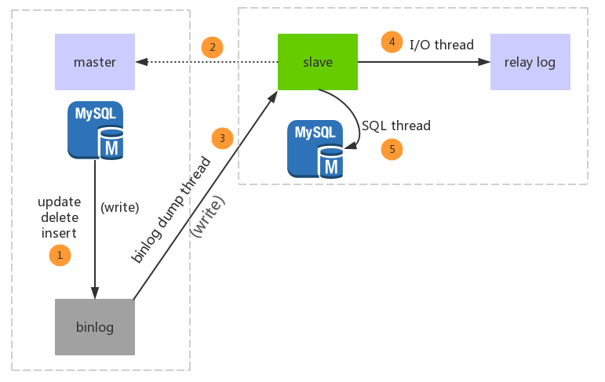
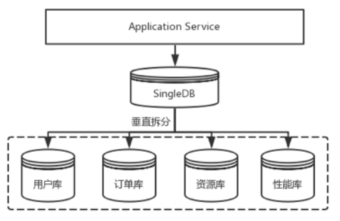
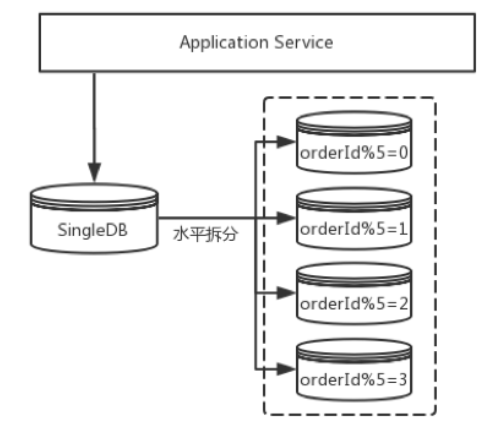

# Mysql高性能优化方案

## 一、概述

### 	1、业务场景

```
	一个呼叫中心系统每天会收到大量工单数据，最终数据落到数据库，当接线员频繁查询、写入工单数据达到一定的并发量，会对数据库造成很大的访问压力。单机版mysql数据库能支撑的最大连接数16384(理论值)，每秒抗并发量大概在2000-3000，大并发会导致数据库服务宕机。
```

### 	2、提高数据库性能

```
	在互联网项目中，数据量大，流量大，并发高，对数据库性能要求响应会很高，尤其是当一个写操作引发表锁时，该表无法继续提供读服务，我们今天基于此背景提供提高数据库性能的几种解决方案。
```

## 二、方案说明

### 	1、设计方向

​	从数据库数据层面来看，影响数据库性能的因素主要在于单库的访问量太大并发量高于其承载能力，锁表后影响读操作、单表的数据量太大导致表访问性能下降，由此我们可以采用如下方式解决：


#### 1.1 读写分离-主从复制

```
思路：
	基于数据库的主从复制，主服务可以负责写操作(当然也可以读)，从数据库(可以有多个)负责读操作，以此来优化缓解单数据库的访问压力。
```

##### 1）主从复制介绍

 

```markdown
主从复制过程：
1.Master 数据库发生变化，记录到Binary log 日志文件中
2.Slave数据库启动一个I/O thread连接Master数据库，请求Master变化的二进制日志
3.Slave I/O获取到的二进制日志，保存到自己的Relay log日志文件中。
4.Slave 的SQL thread定时检查Realy log的变化，更新数据到本库。
```

> 主库发生写操作时，记录数据到`binlog`的方式：
>
> mysql复制主要有三种方式：
> 	1. 基于SQL语句的复制(statement-based replication, SBR)，每一条会修改数据的sql语句会记录到binlog中。
> 	2. 基于行的复制(row-based replication, RBR)，不记录每条sql语句的上下文信息，仅需记录哪条数据被修改了，修改成什么样了。
> 	3. 混合模式复制(mixed-based replication, MBR)，以上两种模式的混合使用。
>
> ​	mysql 5.6.5+版本是基于GTIDs（global transaction identifiers）来进行事务复制。只要在主服务器上提交了事务，那么从服务器就一定会执行该事务

##### 2）优缺点：

```
#优点
1、通过增加从服务器来提高数据库的访问性能
2、数据备份，提高数据安全——但是主库数据删除，从库也会被删除！
3、提高数据库可用性。
#缺点：
1、主从间的数据库不是实时同步，会有延迟
2、主服务宕机后，从服务器无法进行写操作，需要切换新主.(当然，有第三方代理服务可以自动完成从到主的切换，比如mycat等)
```


#### 1.2 分库分表[+读写分离]

```d
思路：
	单库业务量大，可以对库进行【垂直拆分】成多个业务库
	库中表数据量大(单表记录数>1000W性能下降严重)，可以对表进行【水平拆分】，可以拆分到单库中或者多个库中。
```

##### 垂直拆分：

 

##### 水平拆分：

 

```
截图来自：https://blog.51cto.com/u_15072904/2617669
参考地址：
https://shardingsphere.apache.org/document/legacy/4.x/document/cn/features/sharding/
```

> 
>
> 分库分表的拆分结果有：
>
> ​	多库单表
>
> ​	单库多表
>
> ​	多库多表

##### 优缺点：

```
#优点：
1、垂直拆分可以实现业务解耦、单库应对的业务访问量减少。
2、水平拆分能够解决单表数据量大的问题。
3、服务负载能力提高

#缺点：
1、拆分规则复杂。
2、库的扩展维护难度较大。
3、跨节点关联join查询、跨库事务问题；单表拆分后维护、查询(如分页查询)不便。
```

> 对于公共表如字典表，可以在每个库都创建一份！

### 	2、具体实现方案

#### 2.1 应用层

```
0、spring:AbstractRoutingDataSource（手动编码借助AOP）--切换数据源(库)
1、Sharding-JDBC(ShardingSphere) - 对读写分离、分库分表
2、TDDL(淘宝的)
3、Atlas(360的)
4、TiDB
```

#### 2.2 代理层

> 伪装数据库，业务端的链接代理层，代理层转发到真正的数据库。

```
1、Mycat
2、Sharding-Proxy(ShardingSphere)
```


> 本次课程是基于应用层上分别演示读写分离、分库分表方案。
>
> 基础环境：
>
> mysql:5.7
>
> docker
>
> jdk8
>
> springboot:2.0.5.RELEASE
>
> mybatis:3.4.6


## 三、读写分离主从复制

参考《mybatis读写分离.md》


## 四、分库分表

我们分库分表的效果——水平拆分：

```
db0
├── t_workorder0
└── t_workorder1 
db1
├── t_workorder0 
└── t_workorder1
```

> 规则如下：
>
> 相同用户数据进入同一个库，同一用户不同工单可能进入该库的不同表
>
> 数据落入规则：
>
> 保存workorder数据，
>
> 分库规则：按照用户ID进行入库，会员ID相同的进入同一个库；memberId%2
>
> 分表规则：按照记录主键ID进行分表写入。id%2


>支持分页。支持排序

### 1、环境准备

准备两个主节点服务（我两个服务中未设置服务端编码集，案例中的都使用非中文测试）

```shell
docker run -itd -p 33065:3306 --name sharding_db0 -e MYSQL_ROOT_PASSWORD=qwe123 mysql:5.7
```

```shell
docker run -itd -p 33066:3306 --name sharding_db1 -e MYSQL_ROOT_PASSWORD=qwe123 mysql:5.7
```

### 2、分库分表设计

分别在两个mysql实例中创建数据库`mydemodb`

分别在两个库中建表：

```sql
CREATE TABLE `t_workorder0` (
	`id` BIGINT(20) NOT NULL,
	`member_id` BIGINT(20) NOT NULL,
	`reason` VARCHAR(50) NULL DEFAULT '' COLLATE 'latin1_swedish_ci',
	`receive_time` DATETIME NOT NULL,
	PRIMARY KEY (`id`) USING BTREE
)
COLLATE='latin1_swedish_ci'
ENGINE=InnoDB
;

CREATE TABLE `t_workorder1` (
	`id` BIGINT(20) NOT NULL,
	`member_id` BIGINT(20) NOT NULL,
	`reason` VARCHAR(50) NULL DEFAULT '' COLLATE 'latin1_swedish_ci',
	`receive_time` DATETIME NOT NULL,
	PRIMARY KEY (`id`) USING BTREE
)mydemodb
COLLATE='latin1_swedish_ci'
ENGINE=InnoDB
;
```

> 由于我没有为服务端配置utf8编码集，导致服务端编码集latin1_swedish_ci，不支持中文。

### 3、代码实现

##### 3.1 `pom.xml`

```xml
<parent>
    <groupId>org.springframework.boot</groupId>
    <artifactId>spring-boot-starter-parent</artifactId>
    <version>2.0.5.RELEASE</version>
    <relativePath/>
</parent>

<properties>
    <java.version>1.8</java.version>
    <mybatis-plus.version>3.1.1</mybatis-plus.version>
    <sharding-sphere.version>4.0.0-RC2</sharding-sphere.version>
</properties>

<dependencies>
    <dependency>
        <groupId>org.springframework.boot</groupId>
        <artifactId>spring-boot-starter-test</artifactId>
    </dependency>
    <dependency>
        <groupId>junit</groupId>
        <artifactId>junit</artifactId>
        <version>4.12</version>
    </dependency>

    <!--mybatis起步依赖-->
    <dependency>
        <groupId>org.mybatis.spring.boot</groupId>
        <artifactId>mybatis-spring-boot-starter</artifactId>
        <version>1.3.2</version>
    </dependency>
    <dependency>
        <groupId>mysql</groupId>
        <artifactId>mysql-connector-java</artifactId>
    </dependency>
    <dependency>
        <groupId>com.alibaba</groupId>
        <artifactId>druid</artifactId>
        <version>1.2.1</version>
    </dependency>
    <!--
        <dependency>
            <groupId>com.alibaba</groupId>
            <artifactId>druid-spring-boot-starter</artifactId>
            <version>1.2.1</version>
        </dependency>-->


    <dependency>
        <groupId>org.springframework.boot</groupId>
        <artifactId>spring-boot-starter-web</artifactId>
    </dependency>
    <dependency>
        <groupId>org.springframework.boot</groupId>
        <artifactId>spring-boot-starter-jdbc</artifactId>
    </dependency>
    <dependency>
        <groupId>org.springframework.boot</groupId>
        <artifactId>spring-boot-starter-aop</artifactId>
    </dependency>


    <!--sharding-jdbc 应用层面上分库分表-->
    <dependency>
        <groupId>org.apache.shardingsphere</groupId>
        <artifactId>sharding-jdbc-spring-boot-starter</artifactId>
        <version>${sharding-sphere.version}</version>
    </dependency>
    <dependency>
        <groupId>org.apache.shardingsphere</groupId>
        <artifactId>sharding-jdbc-spring-namespace</artifactId>
        <version>${sharding-sphere.version}</version>
    </dependency>

</dependencies>
```

##### 3.2 配置分库分表(分片规则)

```yml
spring:
  shardingsphere:
    datasource:
      names: ds0,ds1
      ds0:
        type: com.alibaba.druid.pool.DruidDataSource
        driver-class-name: com.mysql.jdbc.Driver
        url: jdbc:mysql://192.168.111.130:33065/mydemodb?serverTimezone=Asia/Shanghai&useUnicode=true&characterEncoding=utf8
        username: root
        password: qwe123
      ds1:
        type: com.alibaba.druid.pool.DruidDataSource
        driver-class-name: com.mysql.jdbc.Driver
        url: jdbc:mysql://192.168.111.130:33066/mydemodb?serverTimezone=Asia/Shanghai&useUnicode=true&characterEncoding=utf8
        username: root
        password: qwe123
    #分库分表策略
    sharding:
#      binding-tables:
#         配置主从
#        - t_member,t_workorder
#      broadcast-tables: t_common_table #全局的统一的广播表
      tables:
        t_workorder:
          #配置该逻辑表实际使用哪张库 ds0、ds1的哪张表 t_workorder0、t_workorder1
          actual-data-nodes: ds$->{0..1}.t_workorder$->{0..1}
          database-strategy:
            inline:
              sharding-column: member_id
              algorithm-expression: ds$->{member_id % 2}
          table-strategy:
            inline:
              #基于order_id值进行入表
              sharding-column: id
              algorithm-expression: t_workorder$->{id % 2}
        #如果有其他逻辑表，继续该配置
#        t_othertable
    props:
      sql:
        show: true

```

##### 3.3 mapper接口

mybatis正常开发

```java
public interface WorkorderMapper {

    @Insert("insert into t_workorder(id,member_id,reason,receive_time) values(#{id},#{memberId},#{reason},#{receiveTime})")
    public int insertWorkorder(Workorder workorder);

    @Select("select * from t_workorder")
    public List<Workorder> findAll();
}
```

##### 3.4 引导类

```java
@SpringBootApplication(exclude = DataSourceAutoConfiguration.class)
@MapperScan("com.itheima.sharding.mapper")
public class ShardingApp {
    public static void main(String[] args) {
        SpringApplication.run(ShardingApp.class,args);
    }
}
```

##### 3.5 测试

```java
@RunWith(SpringRunner.class)
@SpringBootTest
public class ShardingTest {
    @Autowired
    private WorkorderService workorderService;

    @Test
    public void shardingInsert(){
        Long memberId01 = 1L;

        Workorder workorder01 = new Workorder();
        workorder01.setId(100L);
        workorder01.setMemberId(memberId01);
        workorder01.setReason("first01");
        workorder01.setReceiveTime(new Date());
        workorderService.insertWorkorder(workorder01); //ds1.表0

        Workorder workorder012 = new Workorder();
        workorder012.setId(101L);
        workorder012.setMemberId(memberId01);
        workorder012.setReason("first02");
        workorder012.setReceiveTime(new Date());
        workorderService.insertWorkorder(workorder012);//ds1.表1

        Long memberId02 = 2L;
        Workorder workorder02 = new Workorder();
        workorder02.setId(200L);
        workorder02.setMemberId(memberId02);
        workorder02.setReason("second");
        workorder02.setReceiveTime(new Date());
        workorderService.insertWorkorder(workorder02);//ds0.表0


        Long memberId03 = 3L;
        Workorder workorder03 = new Workorder();
        workorder03.setId(303L);
        workorder03.setMemberId(memberId03);
        workorder03.setReason("third");
        workorder03.setReceiveTime(new Date());
        workorderService.insertWorkorder(workorder03);//ds1.表1
    }

    @Test
    public void findAll(){
        List<Workorder> workorders = workorderService.findAll();
        System.out.println(workorders.size());
    }

}
```

