# 框架篇

## 1. Spring refresh 流程

**要求**

* 掌握 refresh 的 12 个步骤

**Spring refresh 概述**

refresh 是 AbstractApplicationContext 中的一个方法，负责初始化 ApplicationContext 容器，容器必须调用 refresh 才能正常工作。它的内部主要会调用 12 个方法，我们把它们称为 refresh 的 12 个步骤：

1. prepareRefresh

2. obtainFreshBeanFactory

3. prepareBeanFactory

4. postProcessBeanFactory

5. invokeBeanFactoryPostProcessors

6. registerBeanPostProcessors

7. initMessageSource

8. initApplicationEventMulticaster

9. onRefresh

10. registerListeners

11. finishBeanFactoryInitialization

12. finishRefresh

> ***功能分类***
>
> * 1 为准备环境
>
> * 2 3 4 5 6 为准备 BeanFactory
>
> * 7 8 9 10 12 为准备 ApplicationContext
>
> * 11 为初始化 BeanFactory 中非延迟单例 bean


**1. prepareRefresh**

* 这一步创建和准备了 Environment 对象，它作为 ApplicationContext 的一个成员变量

* Environment 对象的作用之一是为后续 @Value，值注入时提供键值
* Environment 分成三个主要部分
  * systemProperties - 保存 java 环境键值
  * systemEnvironment - 保存系统环境键值
  * 自定义 PropertySource - 保存自定义键值，例如来自于 *.properties 文件的键值


**2. obtainFreshBeanFactory**

* 这一步获取（或创建） BeanFactory，它也是作为 ApplicationContext 的一个成员变量
* BeanFactory 的作用是负责 bean 的创建、依赖注入和初始化，bean 的各项特征由 BeanDefinition 定义
  * BeanDefinition 作为 bean 的设计蓝图，规定了 bean 的特征，如单例多例、依赖关系、初始销毁方法等
  * BeanDefinition 的来源有多种多样，可以是通过 xml 获得、配置类获得、组件扫描获得，也可以是编程添加
* 所有的 BeanDefinition 会存入 BeanFactory 中的 beanDefinitionMap 集合


**3. prepareBeanFactory**

* 这一步会进一步完善 BeanFactory，为它的各项成员变量赋值
* beanExpressionResolver 用来解析 SpEL，常见实现为 StandardBeanExpressionResolver
* propertyEditorRegistrars 会注册类型转换器
  * 它在这里使用了 ResourceEditorRegistrar 实现类
  * 并应用 ApplicationContext 提供的 Environment 完成 ${ } 解析
* registerResolvableDependency 来注册 beanFactory 以及 ApplicationContext，让它们也能用于依赖注入
* beanPostProcessors 是 bean 后处理器集合，会工作在 bean 的生命周期各个阶段，此处会添加两个：
  * ApplicationContextAwareProcessor 用来解析 Aware 接口
  * ApplicationListenerDetector 用来识别容器中 ApplicationListener 类型的 bean


**4. postProcessBeanFactory**

* 这一步是空实现，留给子类扩展。
  * 一般 Web 环境的 ApplicationContext 都要利用它注册新的 Scope，完善 Web 下的 BeanFactory
* 这里体现的是模板方法设计模式

**5. invokeBeanFactoryPostProcessors**

* 这一步会调用 beanFactory 后处理器
* beanFactory 后处理器，充当 beanFactory 的扩展点，可以用来补充或修改 BeanDefinition
* 常见的 beanFactory 后处理器有
  * ConfigurationClassPostProcessor – 解析 @Configuration、@Bean、@Import、@PropertySource 等
  * PropertySourcesPlaceHolderConfigurer – 替换 BeanDefinition 中的 ${ }
  * MapperScannerConfigurer – 补充 Mapper 接口对应的 BeanDefinition

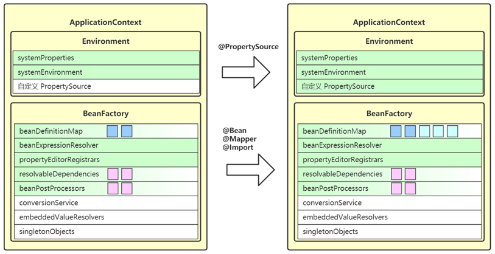

**6. registerBeanPostProcessors**

* 这一步是继续从 beanFactory 中找出 bean 后处理器，添加至 beanPostProcessors 集合中
* bean 后处理器，充当 bean 的扩展点，可以工作在 bean 的实例化、依赖注入、初始化阶段，常见的有：
  * AutowiredAnnotationBeanPostProcessor 功能有：解析 @Autowired，@Value 注解
  * CommonAnnotationBeanPostProcessor 功能有：解析 @Resource，@PostConstruct，@PreDestroy
  * AnnotationAwareAspectJAutoProxyCreator 功能有：为符合切点的目标 bean 自动创建代理


**7. initMessageSource**

* 这一步是为 ApplicationContext 添加 messageSource 成员，实现国际化功能
* 去 beanFactory 内找名为 messageSource 的 bean，如果没有，则提供空的 MessageSource 实现


**8. initApplicationContextEventMulticaster**

* 这一步为 ApplicationContext 添加事件广播器成员，即 applicationContextEventMulticaster
* 它的作用是发布事件给监听器
* 去 beanFactory 找名为 applicationEventMulticaster 的 bean 作为事件广播器，若没有，会创建默认的事件广播器
* 之后就可以调用 ApplicationContext.publishEvent(事件对象) 来发布事件


**9. onRefresh**

* 这一步是空实现，留给子类扩展
  * SpringBoot 中的子类在这里准备了 WebServer，即内嵌 web 容器
* 体现的是模板方法设计模式

**10. registerListeners**

* 这一步会从多种途径找到事件监听器，并添加至 applicationEventMulticaster
* 事件监听器顾名思义，用来接收事件广播器发布的事件，有如下来源
  * 事先编程添加的
  * 来自容器中的 bean
  * 来自于 @EventListener 的解析
* 要实现事件监听器，只需要实现 ApplicationListener 接口，重写其中 onApplicationEvent(E e) 方法即可


**11. finishBeanFactoryInitialization**

* 这一步会将 beanFactory 的成员补充完毕，并初始化所有非延迟单例 bean
* conversionService 也是一套转换机制，作为对 PropertyEditor 的补充
* embeddedValueResolvers 即内嵌值解析器，用来解析 @Value 中的 ${ }，借用的是 Environment 的功能
* singletonObjects 即单例池，缓存所有单例对象
  * 对象的创建都分三个阶段，每一阶段都有不同的 bean 后处理器参与进来，扩展功能


**12. finishRefresh**

* 这一步会为 ApplicationContext 添加 lifecycleProcessor 成员，用来控制容器内需要生命周期管理的 bean
* 如果容器中有名称为 lifecycleProcessor 的 bean 就用它，否则创建默认的生命周期管理器
* 准备好生命周期管理器，就可以实现
  * 调用 context 的 start，即可触发所有实现 LifeCycle 接口 bean 的 start
  * 调用 context 的 stop，即可触发所有实现 LifeCycle 接口 bean 的 stop
* 发布 ContextRefreshed 事件，整个 refresh 执行完成


## 2. Spring bean 生命周期

**要求**

* 掌握 Spring bean 的生命周期

**bean 生命周期 概述**

bean 的生命周期从调用 beanFactory 的 getBean 开始，到这个 bean 被销毁，可以总结为以下七个阶段：

1. 处理名称，检查缓存
2. 处理父子容器
3. 处理 dependsOn
4. 选择 scope 策略
5. 创建 bean
6. 类型转换处理
7. 销毁 bean

> ***注意***
>
> * 划分的阶段和名称并不重要，重要的是理解整个过程中做了哪些事情


**1. 处理名称，检查缓存**

* 这一步会处理别名，将别名解析为实际名称
* 对 FactoryBean 也会特殊处理，如果以 & 开头表示要获取 FactoryBean 本身，否则表示要获取其产品
* 这里针对单例对象会检查一级、二级、三级缓存
  * singletonFactories 三级缓存，存放单例工厂对象
  * earlySingletonObjects 二级缓存，存放单例工厂的产品对象
    * 如果发生循环依赖，产品是代理；无循环依赖，产品是原始对象
  * singletonObjects 一级缓存，存放单例成品对象

**2. 处理父子容器**

* 如果当前容器根据名字找不到这个 bean，此时若父容器存在，则执行父容器的 getBean 流程
* 父子容器的 bean 名称可以重复

**3. 处理 dependsOn**

* 如果当前 bean 有通过 dependsOn 指定了非显式依赖的 bean，这一步会提前创建这些 dependsOn 的 bean
* 所谓非显式依赖，就是指两个 bean 之间不存在直接依赖关系，但需要控制它们的创建先后顺序

**4. 选择 scope 策略**

* 对于 singleton scope，首先到单例池去获取 bean，如果有则直接返回，没有再进入创建流程
* 对于 prototype scope，每次都会进入创建流程
* 对于自定义 scope，例如 request，首先到 request 域获取 bean，如果有则直接返回，没有再进入创建流程

**5.1 创建 bean - 创建 bean 实例**

| **要点**                             | **总结**                                                     |
| ------------------------------------ | ------------------------------------------------------------ |
| 有自定义 TargetSource 的情况         | 由 AnnotationAwareAspectJAutoProxyCreator 创建代理返回       |
| Supplier 方式创建 bean 实例          | 为 Spring 5.0 新增功能，方便编程方式创建  bean  实例         |
| FactoryMethod 方式  创建 bean  实例  | ① 分成静态工厂与实例工厂；② 工厂方法若有参数，需要对工厂方法参数进行解析，利用  resolveDependency；③ 如果有多个工厂方法候选者，还要进一步按权重筛选 |
| AutowiredAnnotationBeanPostProcessor | ① 优先选择带  @Autowired  注解的构造；② 若有唯一的带参构造，也会入选 |
| mbd.getPreferredConstructors         | 选择所有公共构造，这些构造之间按权重筛选                     |
| 采用默认构造                         | 如果上面的后处理器和 BeanDefiniation 都没找到构造，采用默认构造，即使是私有的 |

**5.2 创建 bean - 依赖注入**

| **要点**                             | **总结**                                                     |
| ------------------------------------ | ------------------------------------------------------------ |
| AutowiredAnnotationBeanPostProcessor | 识别   @Autowired  及 @Value  标注的成员，封装为  InjectionMetadata 进行依赖注入 |
| CommonAnnotationBeanPostProcessor    | 识别   @Resource  标注的成员，封装为  InjectionMetadata 进行依赖注入 |
| resolveDependency                    | 用来查找要装配的值，可以识别：① Optional；② ObjectFactory 及 ObjectProvider；③ @Lazy  注解；④ @Value  注解（${  }, #{ }, 类型转换）；⑤ 集合类型（Collection，Map，数组等）；⑥ 泛型和  @Qualifier（用来区分类型歧义）；⑦ primary  及名字匹配（用来区分类型歧义） |
| AUTOWIRE_BY_NAME                     | 根据成员名字找 bean 对象，修改 mbd 的 propertyValues，不会考虑简单类型的成员 |
| AUTOWIRE_BY_TYPE                     | 根据成员类型执行 resolveDependency 找到依赖注入的值，修改  mbd 的 propertyValues |
| applyPropertyValues                  | 根据 mbd 的 propertyValues 进行依赖注入（即xml中 `<property name ref|value/>`） |

**5.3 创建 bean - 初始化**

| **要点**              | **总结**                                                     |
| --------------------- | ------------------------------------------------------------ |
| 内置 Aware 接口的装配 | 包括 BeanNameAware，BeanFactoryAware 等                      |
| 扩展 Aware 接口的装配 | 由 ApplicationContextAwareProcessor 解析，执行时机在  postProcessBeforeInitialization |
| @PostConstruct        | 由 CommonAnnotationBeanPostProcessor 解析，执行时机在  postProcessBeforeInitialization |
| InitializingBean      | 通过接口回调执行初始化                                       |
| initMethod            | 根据 BeanDefinition 得到的初始化方法执行初始化，即 `<bean init-method>` 或 @Bean(initMethod) |
| 创建 aop 代理         | 由 AnnotationAwareAspectJAutoProxyCreator 创建，执行时机在  postProcessAfterInitialization |

**5.4 创建 bean - 注册可销毁 bean**

在这一步判断并登记可销毁 bean

* 判断依据
  * 如果实现了 DisposableBean 或 AutoCloseable 接口，则为可销毁 bean
  * 如果自定义了 destroyMethod，则为可销毁 bean
  * 如果采用 @Bean 没有指定 destroyMethod，则采用自动推断方式获取销毁方法名（close，shutdown）
  * 如果有 @PreDestroy 标注的方法
* 存储位置
  * singleton scope 的可销毁 bean 会存储于 beanFactory 的成员当中
  * 自定义 scope 的可销毁 bean 会存储于对应的域对象当中
  * prototype scope 不会存储，需要自己找到此对象销毁
* 存储时都会封装为 DisposableBeanAdapter 类型对销毁方法的调用进行适配

**6. 类型转换处理**

* 如果 getBean 的 requiredType 参数与实际得到的对象类型不同，会尝试进行类型转换

**7. 销毁 bean**

* 销毁时机
  * singleton bean 的销毁在 ApplicationContext.close 时，此时会找到所有 DisposableBean 的名字，逐一销毁
  * 自定义 scope bean 的销毁在作用域对象生命周期结束时
  * prototype bean 的销毁可以通过自己手动调用 AutowireCapableBeanFactory.destroyBean 方法执行销毁
* 同一 bean 中不同形式销毁方法的调用次序
  * 优先后处理器销毁，即 @PreDestroy
  * 其次 DisposableBean 接口销毁
  * 最后 destroyMethod 销毁（包括自定义名称，推断名称，AutoCloseable 接口 多选一）


## 3. Spring bean 循环依赖

**要求**

* 掌握单例 set 方式循环依赖的原理
* 掌握其它循环依赖的解决方法

**循环依赖的产生**

* 首先要明白，bean 的创建要遵循一定的步骤，必须是创建、注入、初始化三步，这些顺序不能乱


* set 方法（包括成员变量）的循环依赖如图所示

  * 可以在【a 创建】和【a set 注入 b】之间加入 b 的整个流程来解决
  * 【b set 注入 a】 时可以成功，因为之前 a 的实例已经创建完毕

  * a 的顺序，及 b 的顺序都能得到保障

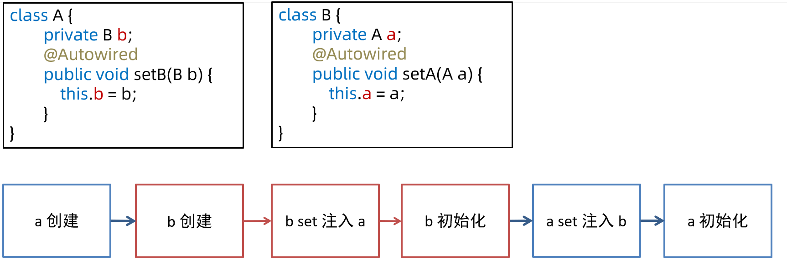

* 构造方法的循环依赖如图所示，显然无法用前面的方法解决

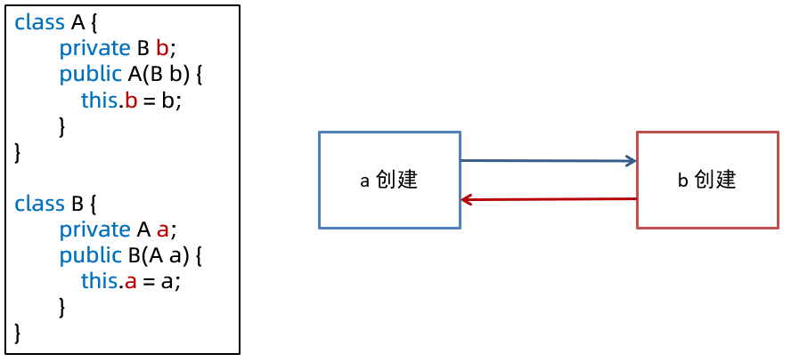

**构造循环依赖的解决**

* 思路1
  * a 注入 b 的代理对象，这样能够保证 a 的流程走通
  * 后续需要用到 b 的真实对象时，可以通过代理间接访问


* 思路2
  * a 注入 b 的工厂对象，让 b 的实例创建被推迟，这样能够保证 a 的流程先走通
  * 后续需要用到 b 的真实对象时，再通过 ObjectFactory 工厂间接访问


* 示例1：用 @Lazy 为构造方法参数生成代理

```java
public class App60_1 {

    static class A {
        private static final Logger log = LoggerFactory.getLogger("A");
        private B b;

        public A(@Lazy B b) {
            log.debug("A(B b) {}", b.getClass());
            this.b = b;
        }

        @PostConstruct
        public void init() {
            log.debug("init()");
        }
    }

    static class B {
        private static final Logger log = LoggerFactory.getLogger("B");
        private A a;

        public B(A a) {
            log.debug("B({})", a);
            this.a = a;
        }

        @PostConstruct
        public void init() {
            log.debug("init()");
        }
    }

    public static void main(String[] args) {
        GenericApplicationContext context = new GenericApplicationContext();
        context.registerBean("a", A.class);
        context.registerBean("b", B.class);
        AnnotationConfigUtils.registerAnnotationConfigProcessors(context.getDefaultListableBeanFactory());
        context.refresh();
        System.out.println();
    }
}
```

* 示例2：用 ObjectProvider 延迟依赖对象的创建

```java
public class App60_2 {

    static class A {
        private static final Logger log = LoggerFactory.getLogger("A");
        private ObjectProvider<B> b;

        public A(ObjectProvider<B> b) {
            log.debug("A({})", b);
            this.b = b;
        }

        @PostConstruct
        public void init() {
            log.debug("init()");
        }
    }

    static class B {
        private static final Logger log = LoggerFactory.getLogger("B");
        private A a;

        public B(A a) {
            log.debug("B({})", a);
            this.a = a;
        }

        @PostConstruct
        public void init() {
            log.debug("init()");
        }
    }

    public static void main(String[] args) {
        GenericApplicationContext context = new GenericApplicationContext();
        context.registerBean("a", A.class);
        context.registerBean("b", B.class);
        AnnotationConfigUtils.registerAnnotationConfigProcessors(context.getDefaultListableBeanFactory());
        context.refresh();

        System.out.println(context.getBean(A.class).b.getObject());
        System.out.println(context.getBean(B.class));
    }
}
```

* 示例3：用 @Scope 产生代理

```java
public class App60_3 {

    public static void main(String[] args) {
        GenericApplicationContext context = new GenericApplicationContext();
        ClassPathBeanDefinitionScanner scanner = new ClassPathBeanDefinitionScanner(context.getDefaultListableBeanFactory());
        scanner.scan("com.beisheng.app60.sub");
        context.refresh();
        System.out.println();
    }
}
```


```java
@Component
class A {
    private static final Logger log = LoggerFactory.getLogger("A");
    private B b;

    public A(B b) {
        log.debug("A(B b) {}", b.getClass());
        this.b = b;
    }

    @PostConstruct
    public void init() {
        log.debug("init()");
    }
}
```


```java
@Scope(proxyMode = ScopedProxyMode.TARGET_CLASS)
@Component
class B {
    private static final Logger log = LoggerFactory.getLogger("B");
    private A a;

    public B(A a) {
        log.debug("B({})", a);
        this.a = a;
    }

    @PostConstruct
    public void init() {
        log.debug("init()");
    }
}
```


* 示例4：用 Provider 接口解决，原理上与 ObjectProvider 一样，Provider 接口是独立的 jar 包，需要加入依赖

```xml
<dependency>
    <groupId>javax.inject</groupId>
    <artifactId>javax.inject</artifactId>
    <version>1</version>
</dependency>
```


```java
public class App60_4 {

    static class A {
        private static final Logger log = LoggerFactory.getLogger("A");
        private Provider<B> b;

        public A(Provider<B> b) {
            log.debug("A({}})", b);
            this.b = b;
        }

        @PostConstruct
        public void init() {
            log.debug("init()");
        }
    }

    static class B {
        private static final Logger log = LoggerFactory.getLogger("B");
        private A a;

        public B(A a) {
            log.debug("B({}})", a);
            this.a = a;
        }

        @PostConstruct
        public void init() {
            log.debug("init()");
        }
    }

    public static void main(String[] args) {
        GenericApplicationContext context = new GenericApplicationContext();
        context.registerBean("a", A.class);
        context.registerBean("b", B.class);
        AnnotationConfigUtils.registerAnnotationConfigProcessors(context.getDefaultListableBeanFactory());
        context.refresh();

        System.out.println(context.getBean(A.class).b.get());
        System.out.println(context.getBean(B.class));
    }
}
```


### 解决 set 循环依赖的原理

**一级缓存**

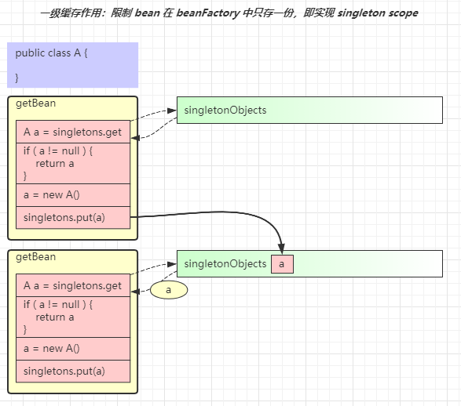

作用是保证单例对象仅被创建一次

* 第一次走 `getBean("a")` 流程后，最后会将成品 a 放入 singletonObjects 一级缓存
* 后续再走 `getBean("a")` 流程时，先从一级缓存中找，这时已经有成品 a，就无需再次创建

**一级缓存与循环依赖**

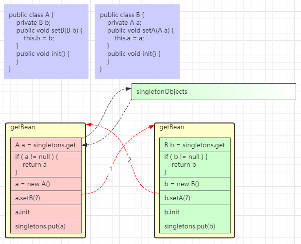

一级缓存无法解决循环依赖问题，分析如下

* 无论是获取 bean a 还是获取 bean b，走的方法都是同一个 getBean 方法，假设先走 `getBean("a")`
* 当 a 的实例对象创建，接下来执行 `a.setB()` 时，需要走 `getBean("b")` 流程，红色箭头 1
* 当 b 的实例对象创建，接下来执行 `b.setA()` 时，又回到了 `getBean("a")` 的流程，红色箭头 2
* 但此时 singletonObjects 一级缓存内没有成品的 a，陷入了死循环

**二级缓存**

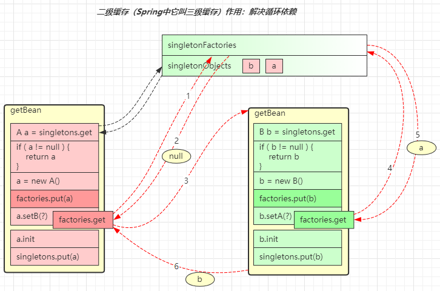

解决思路如下：

* 再增加一个 singletonFactories 缓存
* 在依赖注入前，即 `a.setB()` 以及 `b.setA()` 将 a 及 b 的半成品对象（未完成依赖注入和初始化）放入此缓存
* 执行依赖注入时，先看看 singletonFactories 缓存中是否有半成品的对象，如果有拿来注入，顺利走完流程

对于上面的图

* `a = new A()` 执行之后就会把这个半成品的 a 放入 singletonFactories 缓存，即 `factories.put(a)`
* 接下来执行 `a.setB()`，走入 `getBean("b")` 流程，红色箭头 3
* 这回再执行到 `b.setA()` 时，需要一个 a 对象，有没有呢？有！
* `factories.get()` 在 singletonFactories  缓存中就可以找到，红色箭头 4 和 5
* b 的流程能够顺利走完，将 b 成品放入 singletonObject 一级缓存，返回到 a 的依赖注入流程，红色箭头 6

**二级缓存与创建代理**

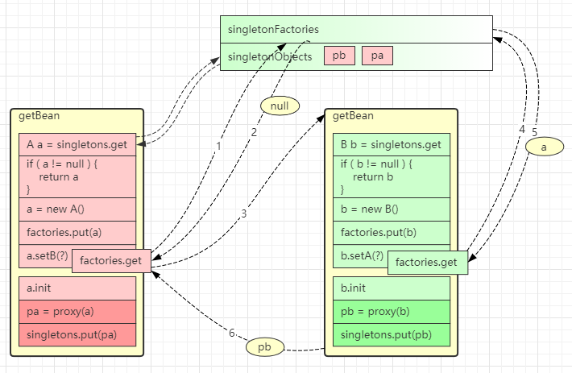

二级缓存无法正确处理循环依赖并且包含有代理创建的场景，分析如下

* spring 默认要求，在 `a.init` 完成之后才能创建代理 `pa = proxy(a)`
* 由于 a 的代理创建时机靠后，在执行 `factories.put(a)` 向 singletonFactories 中放入的还是原始对象
* 接下来箭头 3、4、5 这几步 b 对象拿到和注入的都是原始对象

**三级缓存**


简单分析的话，只需要将代理的创建时机放在依赖注入之前即可，但 spring 仍然希望代理的创建时机在 init 之后，只有出现循环依赖时，才会将代理的创建时机提前。所以解决思路稍显复杂：

* 图中 `factories.put(fa)` 放入的既不是原始对象，也不是代理对象而是工厂对象 fa
* 当检查出发生循环依赖时，fa 的产品就是代理 pa，没有发生循环依赖，fa 的产品是原始对象 a
* 假设出现了循环依赖，拿到了 singletonFactories 中的工厂对象，通过在依赖注入前获得了 pa，红色箭头 5
* 这回 `b.setA()` 注入的就是代理对象，保证了正确性，红色箭头 7
* 还需要把 pa 存入新加的 earlySingletonObjects 缓存，红色箭头 6
* `a.init` 完成后，无需二次创建代理，从哪儿找到 pa 呢？earlySingletonObjects 已经缓存，蓝色箭头 9

当成品对象产生，放入 singletonObject 后，singletonFactories 和 earlySingletonObjects 就中的对象就没有用处，清除即可


## 4. Spring 事务失效

**要求**

* 掌握事务失效的八种场景

**1. 抛出检查异常导致事务不能正确回滚**

```java
@Service
public class Service1 {

    @Autowired
    private AccountMapper accountMapper;

    @Transactional
    public void transfer(int from, int to, int amount) throws FileNotFoundException {
        int fromBalance = accountMapper.findBalanceBy(from);
        if (fromBalance - amount >= 0) {
            accountMapper.update(from, -1 * amount);
            new FileInputStream("aaa");
            accountMapper.update(to, amount);
        }
    }
}
```

* 原因：Spring 默认只会回滚非检查异常

* 解法：配置 rollbackFor 属性
  * `@Transactional(rollbackFor = Exception.class)`


**2. 业务方法内自己 try-catch 异常导致事务不能正确回滚**

```java
@Service
public class Service2 {

    @Autowired
    private AccountMapper accountMapper;

    @Transactional(rollbackFor = Exception.class)
    public void transfer(int from, int to, int amount)  {
        try {
            int fromBalance = accountMapper.findBalanceBy(from);
            if (fromBalance - amount >= 0) {
                accountMapper.update(from, -1 * amount);
                new FileInputStream("aaa");
                accountMapper.update(to, amount);
            }
        } catch (FileNotFoundException e) {
            e.printStackTrace();
        }
    }
}
```

* 原因：事务通知只有捉到了目标抛出的异常，才能进行后续的回滚处理，如果目标自己处理掉异常，事务通知无法知悉

* 解法1：异常原样抛出
  * 在 catch 块添加 `throw new RuntimeException(e);`

* 解法2：手动设置 TransactionStatus.setRollbackOnly()
  * 在 catch 块添加 `TransactionInterceptor.currentTransactionStatus().setRollbackOnly();`


**3. aop 切面顺序导致导致事务不能正确回滚**

```java
@Service
public class Service3 {

    @Autowired
    private AccountMapper accountMapper;

    @Transactional(rollbackFor = Exception.class)
    public void transfer(int from, int to, int amount) throws FileNotFoundException {
        int fromBalance = accountMapper.findBalanceBy(from);
        if (fromBalance - amount >= 0) {
            accountMapper.update(from, -1 * amount);
            new FileInputStream("aaa");
            accountMapper.update(to, amount);
        }
    }
}
```


```java
@Aspect
public class MyAspect {
    @Around("execution(* transfer(..))")
    public Object around(ProceedingJoinPoint pjp) throws Throwable {
        LoggerUtils.get().debug("log:{}", pjp.getTarget());
        try {
            return pjp.proceed();
        } catch (Throwable e) {
            e.printStackTrace();
            return null;
        }
    }
}
```

* 原因：事务切面优先级最低，但如果自定义的切面优先级和他一样，则还是自定义切面在内层，这时若自定义切面没有正确抛出异常…

* 解法1、2：同情况2 中的解法:1、2
* 解法3：调整切面顺序，在 MyAspect 上添加 `@Order(Ordered.LOWEST_PRECEDENCE - 1)` （不推荐）


**4. 非 public 方法导致的事务失效**

```java
@Service
public class Service4 {

    @Autowired
    private AccountMapper accountMapper;

    @Transactional
    void transfer(int from, int to, int amount) throws FileNotFoundException {
        int fromBalance = accountMapper.findBalanceBy(from);
        if (fromBalance - amount >= 0) {
            accountMapper.update(from, -1 * amount);
            accountMapper.update(to, amount);
        }
    }
}
```

* 原因：Spring 为方法创建代理、添加事务通知、前提条件都是该方法是 public 的

* 解法1：改为 public 方法
* 解法2：添加 bean 配置如下（不推荐）

```java
@Bean
public TransactionAttributeSource transactionAttributeSource() {
    return new AnnotationTransactionAttributeSource(false);
}
```


**5. 父子容器导致的事务失效**

```java
packag tx.app.service;

// ...

@Service
public class Service5 {

    @Autowired
    private AccountMapper accountMapper;

    @Transactional(rollbackFor = Exception.class)
    public void transfer(int from, int to, int amount) throws FileNotFoundException {
        int fromBalance = accountMapper.findBalanceBy(from);
        if (fromBalance - amount >= 0) {
            accountMapper.update(from, -1 * amount);
            accountMapper.update(to, amount);
        }
    }
}
```

控制器类

```java
package tx.app.controller;

// ...

@Controller
public class AccountController {

    @Autowired
    public Service5 service;

    public void transfer(int from, int to, int amount) throws FileNotFoundException {
        service.transfer(from, to, amount);
    }
}
```

App 配置类

```java
@Configuration
@ComponentScan("tx.app.service")
@EnableTransactionManagement
// ...
public class AppConfig {
    // ... 有事务相关配置
}
```

Web 配置类

```java
@Configuration
@ComponentScan("tx.app")
// ...
public class WebConfig {
    // ... 无事务配置
}
```

现在配置了父子容器，WebConfig 对应子容器，AppConfig 对应父容器，发现事务依然失效

* 原因：子容器扫描范围过大，把未加事务配置的 service 扫描进来

* 解法1：各扫描各的，不要图简便

* 解法2：不要用父子容器，所有 bean 放在同一容器


**6. 调用本类方法导致传播行为失效**

```java
@Service
public class Service6 {

    @Transactional(propagation = Propagation.REQUIRED, rollbackFor = Exception.class)
    public void foo() throws FileNotFoundException {
        LoggerUtils.get().debug("foo");
        bar();
    }

    @Transactional(propagation = Propagation.REQUIRES_NEW, rollbackFor = Exception.class)
    public void bar() throws FileNotFoundException {
        LoggerUtils.get().debug("bar");
    }
}
```

* 原因：本类方法调用不经过代理，因此无法增强

* 解法1：依赖注入自己（代理）来调用

* 解法2：通过 AopContext 拿到代理对象，来调用

* 解法3：通过 CTW，LTW 实现功能增强

解法1

```java
@Service
public class Service6 {

	@Autowired
	private Service6 proxy; // 本质上是一种循环依赖

    @Transactional(propagation = Propagation.REQUIRED, rollbackFor = Exception.class)
    public void foo() throws FileNotFoundException {
        LoggerUtils.get().debug("foo");
		System.out.println(proxy.getClass());
		proxy.bar();
    }

    @Transactional(propagation = Propagation.REQUIRES_NEW, rollbackFor = Exception.class)
    public void bar() throws FileNotFoundException {
        LoggerUtils.get().debug("bar");
    }
}
```

解法2，还需要在 AppConfig 上添加 `@EnableAspectJAutoProxy(exposeProxy = true)`

```java
@Service
public class Service6 {

    @Transactional(propagation = Propagation.REQUIRED, rollbackFor = Exception.class)
    public void foo() throws FileNotFoundException {
        LoggerUtils.get().debug("foo");
        ((Service6) AopContext.currentProxy()).bar();
    }

    @Transactional(propagation = Propagation.REQUIRES_NEW, rollbackFor = Exception.class)
    public void bar() throws FileNotFoundException {
        LoggerUtils.get().debug("bar");
    }
}
```


**7. @Transactional 没有保证原子行为**

```java
@Service
public class Service7 {

    private static final Logger logger = LoggerFactory.getLogger(Service7.class);

    @Autowired
    private AccountMapper accountMapper;

    @Transactional(rollbackFor = Exception.class)
    public void transfer(int from, int to, int amount) {
        int fromBalance = accountMapper.findBalanceBy(from);
        logger.debug("更新前查询余额为: {}", fromBalance);
        if (fromBalance - amount >= 0) {
            accountMapper.update(from, -1 * amount);
            accountMapper.update(to, amount);
        }
    }

    public int findBalance(int accountNo) {
        return accountMapper.findBalanceBy(accountNo);
    }
}
```

上面的代码实际上是有 bug 的，假设 from 余额为 1000，两个线程都来转账 1000，可能会出现扣减为负数的情况

* 原因：事务的原子性仅涵盖 insert、update、delete、select … for update 语句，select 方法并不阻塞


* 如上图所示，红色线程和蓝色线程的查询都发生在扣减之前，都以为自己有足够的余额做扣减


**8. @Transactional 方法导致的 synchronized 失效**

针对上面的问题，能否在方法上加 synchronized 锁来解决呢？

```java
@Service
public class Service7 {

    private static final Logger logger = LoggerFactory.getLogger(Service7.class);

    @Autowired
    private AccountMapper accountMapper;

    @Transactional(rollbackFor = Exception.class)
    public synchronized void transfer(int from, int to, int amount) {
        int fromBalance = accountMapper.findBalanceBy(from);
        logger.debug("更新前查询余额为: {}", fromBalance);
        if (fromBalance - amount >= 0) {
            accountMapper.update(from, -1 * amount);
            accountMapper.update(to, amount);
        }
    }

    public int findBalance(int accountNo) {
        return accountMapper.findBalanceBy(accountNo);
    }
}
```

答案是不行，原因如下：

* synchronized 保证的仅是目标方法的原子性，环绕目标方法的还有 commit 等操作，它们并未处于 sync 块内
* 可以参考下图发现，蓝色线程的查询只要在红色线程提交之前执行，那么依然会查询到有 1000 足够余额来转账


* 解法1：synchronized 范围应扩大至代理方法调用

* 解法2：使用 select … for update 替换 select


## 5. Spring MVC 执行流程

**要求**

* 掌握 Spring MVC 的执行流程
* 了解 Spring MVC 的重要组件的作用

**概要**

我把整个流程分成三个阶段

* 准备阶段
* 匹配阶段
* 执行阶段

**准备阶段**

1. 在 Web 容器第一次用到 DispatcherServlet 的时候，会创建其对象并执行 init 方法

2. init 方法内会创建 Spring Web 容器，并调用容器 refresh 方法

3. refresh 过程中会创建并初始化 SpringMVC 中的重要组件， 例如 MultipartResolver，HandlerMapping，HandlerAdapter，HandlerExceptionResolver、ViewResolver 等

4. 容器初始化后，会将上一步初始化好的重要组件，赋值给 DispatcherServlet 的成员变量，留待后用

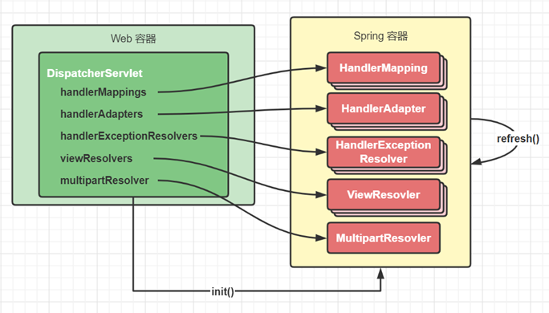

**匹配阶段**

1. 用户发送的请求统一到达前端控制器 DispatcherServlet

2. DispatcherServlet 遍历所有 HandlerMapping ，找到与路径匹配的处理器

   ① HandlerMapping 有多个，每个 HandlerMapping 会返回不同的处理器对象，谁先匹配，返回谁的处理器。其中能识别 @RequestMapping 的优先级最高

   ② 对应 @RequestMapping 的处理器是 HandlerMethod，它包含了控制器对象和控制器方法信息

   ③ 其中路径与处理器的映射关系在 HandlerMapping 初始化时就会建立好

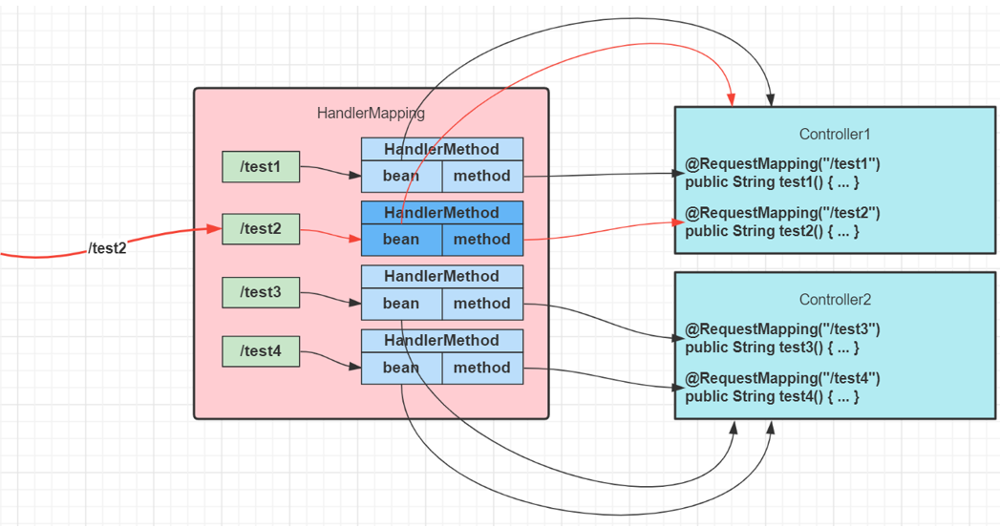

3. 将 HandlerMethod 连同匹配到的拦截器，生成调用链对象 HandlerExecutionChain 返回

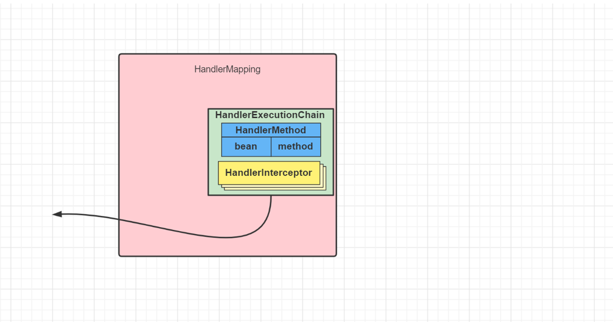

4. 遍历HandlerAdapter 处理器适配器，找到能处理 HandlerMethod 的适配器对象，开始调用

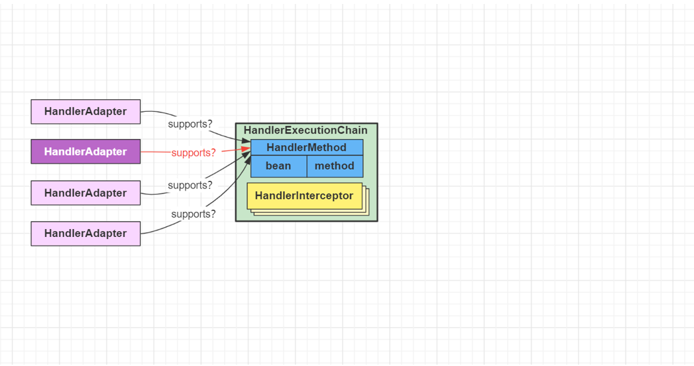

**调用阶段**

1. 执行拦截器 preHandle

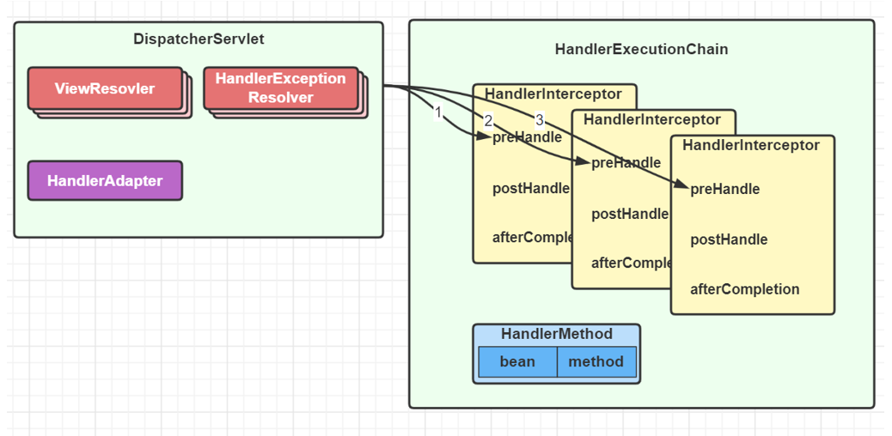

2. 由 HandlerAdapter 调用 HandlerMethod

   ① 调用前处理不同类型的参数

   ② 调用后处理不同类型的返回值

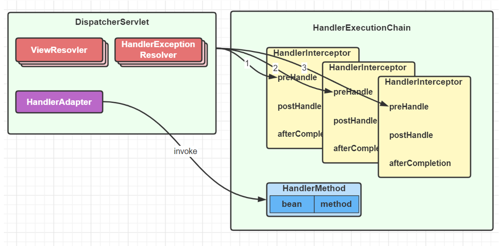

3. 第 2 步没有异常

   ① 返回 ModelAndView

   ② 执行拦截器 postHandle 方法

   ③ 解析视图，得到 View 对象，进行视图渲染

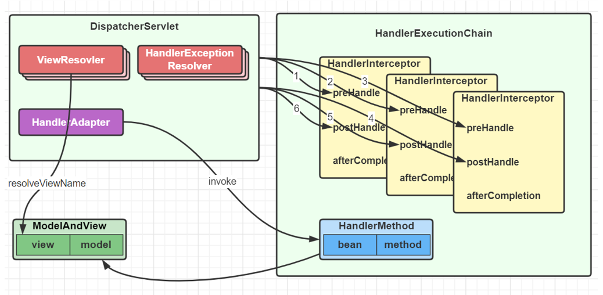

4. 第 2 步有异常，进入 HandlerExceptionResolver 异常处理流程

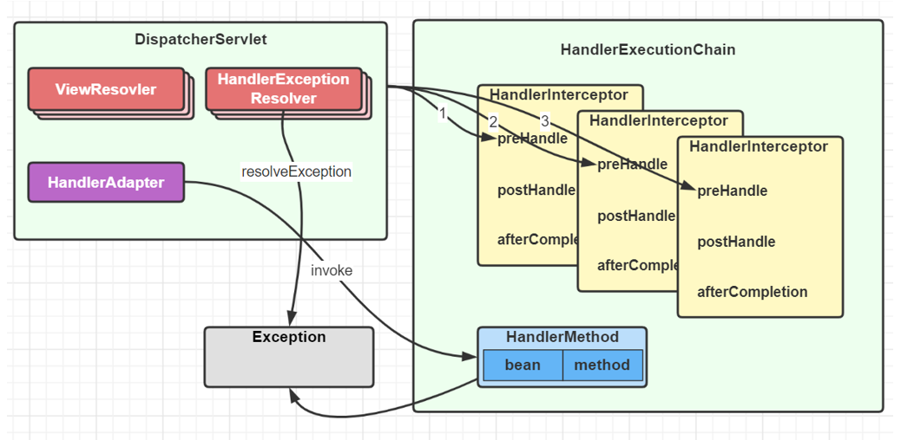

5. 最后都会执行拦截器的 afterCompletion 方法

6. 如果控制器方法标注了 @ResponseBody 注解，则在第 2 步，就会生成 json 结果，并标记 ModelAndView 已处理，这样就不会执行第 3 步的视图渲染


## 6. Spring 注解

**要求**

* 掌握 Spring 常见注解

> ***提示***
>
> * 注解的详细列表请参考：面试题-spring-注解.xmind
> * 下面列出了视频中重点提及的注解，考虑到大部分注解你已经比较熟悉了，仅对个别的作简要说明


**事务注解**

* @EnableTransactionManagement，会额外加载 4 个 bean
  * BeanFactoryTransactionAttributeSourceAdvisor 事务切面类
  * TransactionAttributeSource 用来解析事务属性
  * TransactionInterceptor 事务拦截器
  * TransactionalEventListenerFactory 事务监听器工厂
* @Transactional

**核心**

* @Order

**切面**

* @EnableAspectJAutoProxy
  * 会加载 AnnotationAwareAspectJAutoProxyCreator，它是一个 bean 后处理器，用来创建代理
  * 如果没有配置 @EnableAspectJAutoProxy，又需要用到代理（如事务）则会使用 InfrastructureAdvisorAutoProxyCreator 这个 bean 后处理器

**组件扫描与配置类**

* @Component

* @Controller

* @Service

* @Repository

* @ComponentScan

* @Conditional

* @Configuration

  * 配置类其实相当于一个工厂, 标注 @Bean 注解的方法相当于工厂方法
  * @Bean 不支持方法重载, 如果有多个重载方法, 仅有一个能入选为工厂方法
  * @Configuration 默认会为标注的类生成代理, 其目的是保证 @Bean 方法相互调用时, 仍然能保证其单例特性
  * @Configuration 中如果含有 BeanFactory 后处理器, 则实例工厂方法会导致 MyConfig 提前创建, 造成其依赖注入失败，解决方法是改用静态工厂方法或直接为 @Bean 的方法参数依赖注入, 针对 Mapper 扫描可以改用注解方式

* @Bean

* @Import

  * 四种用法

    ① 引入单个 bean

    ② 引入一个配置类

    ③ 通过 Selector 引入多个类

    ④ 通过 beanDefinition 注册器

  * 解析规则

    * 同一配置类中, @Import 先解析  @Bean 后解析
    * 同名定义, 默认后面解析的会覆盖前面解析的
    * 不允许覆盖的情况下, 如何能够让 MyConfig(主配置类) 的配置优先? (虽然覆盖方式能解决)
    * 采用 DeferredImportSelector，因为它最后工作, 可以简单认为先解析 @Bean, 再 Import

* @Lazy

  * 加在类上，表示此类延迟实例化、初始化
  * 加在方法参数上，此参数会以代理方式注入

* @PropertySource

**依赖注入**

* @Autowired
* @Qualifier
* @Value

**mvc mapping**

* @RequestMapping，可以派生多个注解如 @GetMapping 等

**mvc rest**

* @RequestBody
* @ResponseBody，组合 @Controller =>  @RestController
* @ResponseStatus

**mvc 统一处理**

* @ControllerAdvice，组合 @ResponseBody => @RestControllerAdvice
* @ExceptionHandler

**mvc 参数**

* @PathVariable

**mvc ajax**

* @CrossOrigin

**boot auto**

* @SpringBootApplication
* @EnableAutoConfiguration
* @SpringBootConfiguration

**boot condition**

* @ConditionalOnClass，classpath 下存在某个 class 时，条件才成立
* @ConditionalOnMissingBean，beanFactory 内不存在某个 bean 时，条件才成立
* @ConditionalOnProperty，配置文件中存在某个 property（键、值）时，条件才成立

**boot properties**

* @ConfigurationProperties，会将当前 bean 的属性与配置文件中的键值进行绑定
* @EnableConfigurationProperties，会添加两个较为重要的 bean
  * ConfigurationPropertiesBindingPostProcessor，bean 后处理器，在 bean 初始化前调用下面的 binder
  * ConfigurationPropertiesBinder，真正执行绑定操作


## 7. SpringBoot 自动配置原理

**要求**

* 掌握 SpringBoot 自动配置原理

**自动配置原理**

@SpringBootConfiguration 是一个组合注解，由 @ComponentScan、@EnableAutoConfiguration 和 @SpringBootConfiguration 组成

1. @SpringBootConfiguration 与普通 @Configuration 相比，唯一区别是前者要求整个 app 中只出现一次
2. @ComponentScan
   * excludeFilters - 用来在组件扫描时进行排除，也会排除自动配置类

3. @EnableAutoConfiguration 也是一个组合注解，由下面注解组成
   * @AutoConfigurationPackage – 用来记住扫描的起始包
   * @Import(AutoConfigurationImportSelector.class) 用来加载 `META-INF/spring.factories` 中的自动配置类

**为什么不使用 @Import 直接引入自动配置类**

有两个原因：

1. 让主配置类和自动配置类变成了强耦合，主配置类不应该知道有哪些从属配置
2. 直接用 `@Import(自动配置类.class)`，引入的配置解析优先级较高，自动配置类的解析应该在主配置没提供时作为默认配置

因此，采用了 `@Import(AutoConfigurationImportSelector.class)`

* 由 `AutoConfigurationImportSelector.class` 去读取 `META-INF/spring.factories` 中的自动配置类，实现了弱耦合。
* 另外 `AutoConfigurationImportSelector.class` 实现了 DeferredImportSelector 接口，让自动配置的解析晚于主配置的解析


## 8. Spring 中的设计模式

**要求**

* 掌握 Spring 中常见的设计模式

**1. Spring 中的 Singleton**

请大家区分 singleton pattern 与 Spring 中的 singleton bean

* 根据单例模式的目的 *Ensure a class only has one instance, and provide a global point of access to it*
* 显然 Spring 中的 singleton bean 并非实现了单例模式，singleton bean 只能保证每个容器内，相同 id 的 bean 单实例
* 当然 Spring 中也用到了单例模式，例如
  * org.springframework.transaction.TransactionDefinition#withDefaults
  * org.springframework.aop.TruePointcut#INSTANCE
  * org.springframework.aop.interceptor.ExposeInvocationInterceptor#ADVISOR
  * org.springframework.core.annotation.AnnotationAwareOrderComparator#INSTANCE
  * org.springframework.core.OrderComparator#INSTANCE

**2. Spring 中的 Builder**

定义 *Separate the construction of a complex object from its representation so that the same construction process can create different representations*

它的主要亮点有三处：

1. 较为灵活的构建产品对象

2. 在不执行最后 build 方法前，产品对象都不可用

3. 构建过程采用链式调用，看起来比较爽

Spring 中体现 Builder 模式的地方：

* org.springframework.beans.factory.support.BeanDefinitionBuilder

* org.springframework.web.util.UriComponentsBuilder

* org.springframework.http.ResponseEntity.HeadersBuilder

* org.springframework.http.ResponseEntity.BodyBuilder

**3. Spring 中的 Factory Method**

定义 *Define an interface for creating an object, but let subclasses decide which class to instantiate. Factory Method lets a class defer instantiation to subclasses*

根据上面的定义，Spring 中的 ApplicationContext 与 BeanFactory 中的 getBean 都可以视为工厂方法，它隐藏了 bean （产品）的创建过程和具体实现

Spring 中其它工厂：

* org.springframework.beans.factory.FactoryBean

* @Bean 标注的静态方法及实例方法

* ObjectFactory 及 ObjectProvider

前两种工厂主要封装第三方的 bean 的创建过程，后两种工厂可以推迟 bean 创建，解决循环依赖及单例注入多例等问题

**4. Spring 中的 Adapter**

定义 *Convert the interface of a class into another interface clients expect. Adapter lets classes work together that couldn't otherwise because of incompatible interfaces*

典型的实现有两处：

* org.springframework.web.servlet.HandlerAdapter – 因为控制器实现有各种各样，比如有
  * 大家熟悉的 @RequestMapping 标注的控制器实现
  * 传统的基于 Controller 接口（不是 @Controller注解啊）的实现
  * 较新的基于 RouterFunction 接口的实现
  * 它们的处理方法都不一样，为了统一调用，必须适配为 HandlerAdapter 接口
* org.springframework.beans.factory.support.DisposableBeanAdapter – 因为销毁方法多种多样，因此都要适配为 DisposableBean 来统一调用销毁方法

**5. Spring 中的 Composite**

定义 *Compose objects into tree structures to represent part-whole hierarchies. Composite lets clients treat individual objects and compositions of objects uniformly*

典型实现有：

* org.springframework.web.method.support.HandlerMethodArgumentResolverComposite
* org.springframework.web.method.support.HandlerMethodReturnValueHandlerComposite
* org.springframework.web.servlet.handler.HandlerExceptionResolverComposite
* org.springframework.web.servlet.view.ViewResolverComposite

composite 对象的作用是，将分散的调用集中起来，统一调用入口，它的特征是，与具体干活的实现实现同一个接口，当调用 composite 对象的接口方法时，其实是委托具体干活的实现来完成

**6. Spring 中的 Decorator**

定义 *Attach additional responsibilities to an object dynamically. Decorators provide a flexible alternative to subclassing for extending functionality*

典型实现：

* org.springframework.web.util.ContentCachingRequestWrapper

**7. Spring 中的 Proxy**

定义 *Provide a surrogate or placeholder for another object to control access to it*

装饰器模式注重的是功能增强，避免子类继承方式进行功能扩展，而代理模式更注重控制目标的访问

典型实现：

* org.springframework.aop.framework.JdkDynamicAopProxy
* org.springframework.aop.framework.ObjenesisCglibAopProxy

**8. Spring 中的 Chain of Responsibility**

定义 *Avoid coupling the sender of a request to its receiver by giving more than one object a chance to handle the request. Chain the receiving objects and pass the request along the chain until an object handles it*

典型实现：

* org.springframework.web.servlet.HandlerInterceptor

**9. Spring 中的 Observer**

定义 *Define a one-to-many dependency between objects so that when one object changes state, all its dependents are notified and updated automatically*

典型实现：

* org.springframework.context.ApplicationListener
* org.springframework.context.event.ApplicationEventMulticaster
* org.springframework.context.ApplicationEvent

**10. Spring 中的 Strategy**

定义 *Define a family of algorithms, encapsulate each one, and make them interchangeable. Strategy lets the algorithm vary independently from clients that use it*

典型实现：

* org.springframework.beans.factory.support.InstantiationStrategy
* org.springframework.core.annotation.MergedAnnotations.SearchStrategy
* org.springframework.boot.autoconfigure.condition.SearchStrategy

**11. Spring 中的 Template Method**

定义 *Define the skeleton of an algorithm in an operation, deferring some steps to subclasses. Template Method lets subclasses redefine certain steps of an algorithm without changing the algorithm's structure*

典型实现：

* 大部分以 Template 命名的类，如 JdbcTemplate，TransactionTemplate
* 很多以 Abstract 命名的类，如 AbstractApplicationContext
